# 欢迎来到未来 [01-Raw/26生成式软件工程/NJU]

- 作者：绿导师原谅你了
- 时长：1:39:59
- 来源：[https://www.bilibili.com/video/BV1pb8o6yE8f](https://www.bilibili.com/video/BV1pb8o6yE8f)
- 由 course2md 生成（179 张截图 / 1524 段语音）

---

## [00:00](https://www.bilibili.com/video/BV1pb8o6yE8f?t=0)

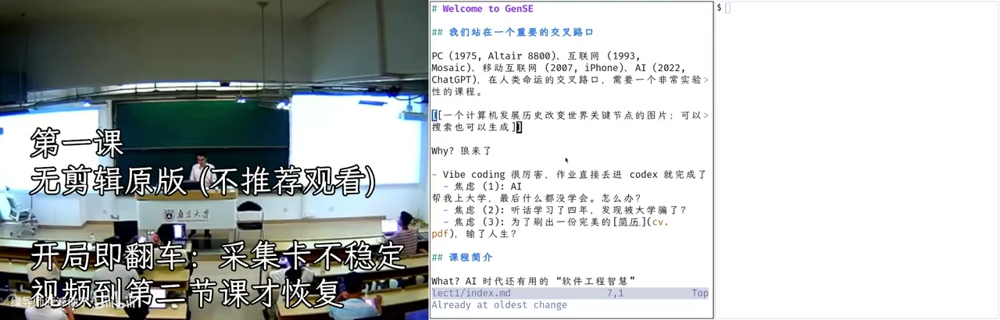

我我干了什么呢？我在，我这是我的Neo Vim对吧？这是Neo Vim。

呃，我按了F。

## [00:07](https://www.bilibili.com/video/BV1pb8o6yE8f?t=7)

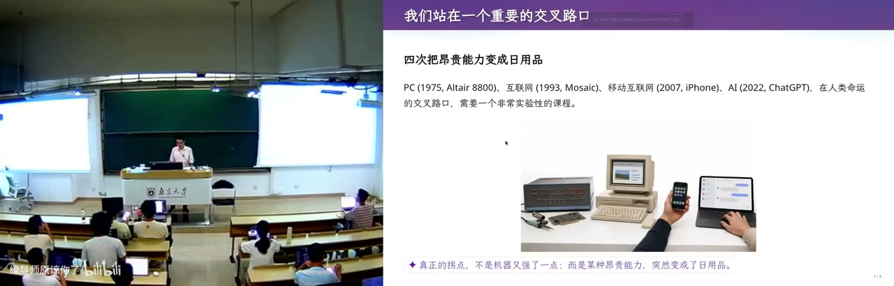

然后打开了一个浏览器，我们就可以正式的开始上课了。那我们今天站在一个非常重要的呃交叉路口，你们是Computer Science的呃同学，我们在历史上就从你们刚开始进入学校开始，呃，讲计算机发展的历史。在计算机发展历史上，其实经历了很多次。

非常重要的变革，呃，我觉得最主要的是，呃，把昂贵的能力变成了日用品。我们在一九七五年的时候有第一台PCGR泰尔八八零零，在图片的左边。这图片也是AI生成的，对吧？你们可以看出有非常明显的呃AI味儿，而且它不是一个，应该不是一个特别强的模型。

那没关系，呃，我我说过，我上课是跟大家一个比较松散的讨论和交流的过程，然后我会，呃，在之后再把这个课程要重新再切片再整理。

啊，整理一次，从PC到互联网，互联网连接了我们的所有人。我至今都还记得，你们没有经历过这个时代。呃，我我那个时候可能是上小学，小学快毕业的时候。

然后我装了一个软件，叫做ICQ。

你们没有听说过这个名字，哎，I C Q叫I C Q，对吧？三个字母I C Q。然后那个时候，腾讯的山寨版还叫O I C Q，O I C Q。然后后来腾讯把它改成了呃Q Q。然后你你在那个时候可以随机的加一个世界上面另一端的人。

然后那时候你加到就是 native speaker，就是他是跟你说英语的。

然后你你你让他一下子发很多的英语，打得非常快，然后你你完全无法理解这个。

呃，他在跟你说什么？然后，因为那因为那个时候，可能我们刚学一点点英语，只会“hello”、“good morning”，对吧？呃，从互联网，然后再到移动互联网，一夜之间，我我印象很深，就一夜之间。

所有的菜场卖菜的人都有支付宝和微信两个二维码，就在很短的呃时间里改变，就一直在改变我们生活的呃方式。然后到二零二二年的时候，是Chat GPT和AI是人类历史上增长最快的呃产品。

啊！我们在这样人类命运的交叉路口，我觉得，呃，我们上课的方式，我们该学什么？其实，呃，我们都需要思考，呃，思考，思考一下。

## [02:13](https://www.bilibili.com/video/BV1pb8o6yE8f?t=133)

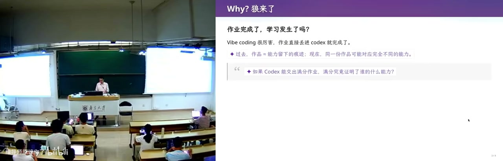

然后就在这样的一个背景下，呃，我决定还是应该，嗯，开这样的一门Web Coding的呃呃课程，为什么呢？

呃，前两天的时候，不是前两天，有有一段时间之前。

大家有一个说法，叫“AI替我上大学”。

哎，我觉得这个说法很对。你想嘛，呃，老师用豆包出题，大家用豆包做作业，然后在这个整个的闭环过程当中，只有学生没有受到训练，对吧？现在Web Coding很厉害，呃，所有的作业直接，对吧？我的操作系统曾曾经这个操作系统的作业折磨大家，然后。

呃，大家在痛苦的折磨中获得提升。现在不一样了，现在你直接把那个作业的链接丢到 Codex 里，对吧？你都不需要，你都不需要有复制粘贴的过程，你只要把那个链接在。

甚至你都不需要告给他链接，你直接说那个蒋老师的操作系统课。

第八个实验，能不能去帮我实现啊？好，就就结束了，嗯。

对，所以在这样的时代，我们应该，我们还怎么办，对吧？还还到到底应不应该学？

学这些编程啊，这样的东西，那答案肯定是既应该也不应该。呃，有些能力你还是需要的，然后，但呃，应该怎么做，我们。

啊，我们不知道，所以我看到的，其实大家都在一种。

啊，非常焦虑的状态，呃，状态上。

呃，第一个AI帮我上大学了。

那上完以后，我最后走，什么都没学会，对吧？我每门课都很好。如果假设每门课都开卷考试，呃，那……

都都是AI答题。

嗯，我全都答对了，但我我出来以后，我发现。

我被AI第一个就被AI取取代了。

对吧？这是第一种焦虑。

然后第二种焦虑是，呃，我相信这边还有另外的同学，呃，可能延续了你中学的时候，呃，很听老师话的这个状态，老师说什么你就做什么，老师

## [04:00](https://www.bilibili.com/video/BV1pb8o6yE8f?t=240)

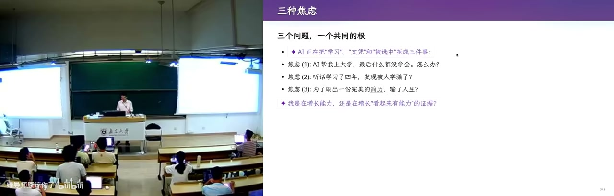

上课每一堂课你都认真的去听，然后每一次作业你都认真的做，然后做完了以后，你发现四年毕业的时候，你被大学骗了。

你你确实学会了点什么，但是你学会的东西。

AI都会做。

对吧？然后，那你也很迷茫。

然后，这个时候，呃，当然，你你，我觉得同学们最切实的，你们现在。

的最痛苦的事情就是保研。

对吧？你们投了很多的简历，呃，给海投很多的地方的简历，然后我其实也也收到了很多这样的呃简历。

我。

我觉得。

## [04:37](https://www.bilibili.com/video/BV1pb8o6yE8f?t=277)

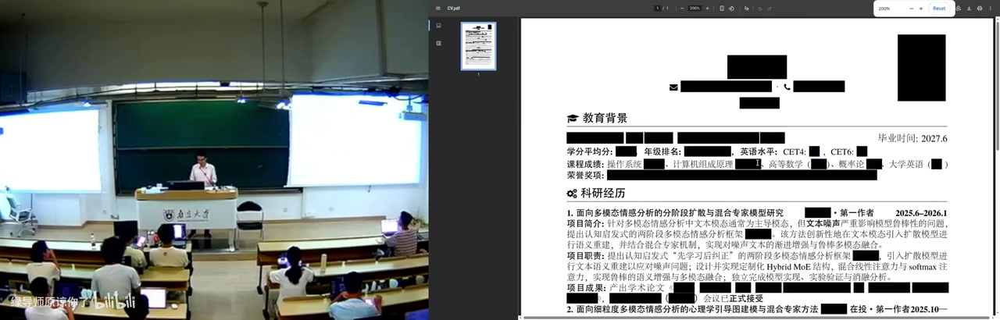

我觉得很糟糕啊！这个，这是一个，呃。

这这是一个简历，我我我用。

首先。

所有这一切都是AI做的，我没有，我没有干任何事儿，我我我我就告诉他。

有一份简历，然后我现在需要在上课的时候展示一下。那我需要把他个人信息给去掉。

那么，这这是这是它把它字符替换成Unicode的方块。如果复制粘贴的话，你会看到这是一个黑色的方，就是方块的。

呃，支付。

呃，OK，希望他希

## [05:06](https://www.bilibili.com/video/BV1pb8o6yE8f?t=306)

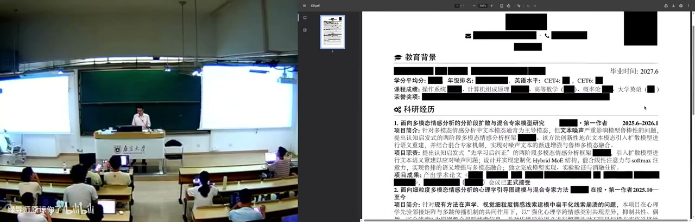

望他把把这个公司都都引掉了，然后就这样的一份简历。

嗯。

## [05:13](https://www.bilibili.com/video/BV1pb8o6yE8f?t=313)

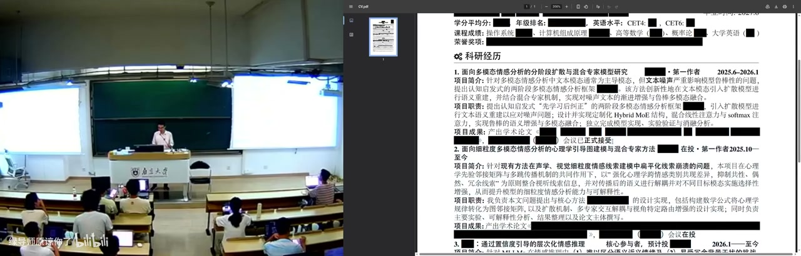

就非常完美的简历啊！一个CCF期刊列列表上面的论文，然后accepted，然后又。

有有有有这个，当然，

## [05:25](https://www.bilibili.com/video/BV1pb8o6yE8f?t=325)

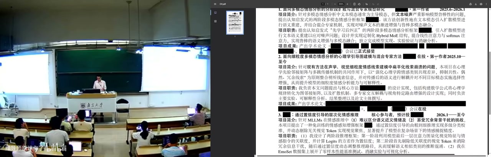

大家都说再投就等于不存在，对吧？因为你你看不到，呃。

那这个简历

## [05:30](https://www.bilibili.com/video/BV1pb8o6yE8f?t=330)

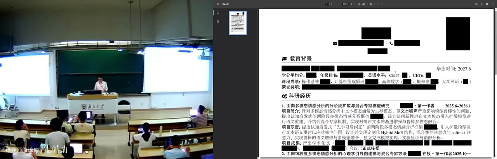

对我来说是一个零分的简历。

呃，因为没有。

没有额外的信息，他甚至没有一个GitHub的链接，没有一个个人的主页，没有一篇这个东西有。

Properly.

这是，就这是一个。

呃，我我我不知道这位同学发生了什么。

但是。

呃，对我来说，这样的一份简历非常的。

呃，非常的糟糕，然后。

## [05:56](https://www.bilibili.com/video/BV1pb8o6yE8f?t=356)

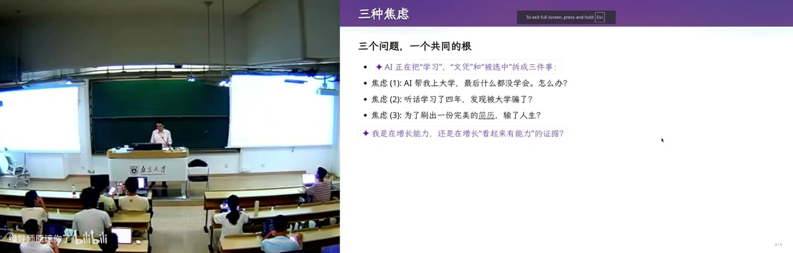

更糟糕的是。

我收到过无数份这样的简历。

然后，可能你们的简历多多少少也是长长这个样子的。

呃，然后这个时候，就你发现你和你的竞争者已经无法区分了。

所有人都是我有一大堆实习，一大堆奖项，一大堆论文，一大堆在投。

那。

是什么能？

让你从这些简历里面脱颖而出，对吧？就如果刚才那份简历都被我认为是零分的简历，你你们。

你们应该怎么样向你的未来的导师去展示你自己？

对吧？然后，所以，所以我我相信这个在座的同学都非常的呃焦虑。但是，好消息是，我

## [06:33](https://www.bilibili.com/video/BV1pb8o6yE8f?t=393)

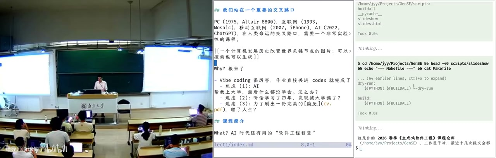

觉得我我希望用呃这一门课来缓解一下大家这样的焦虑的情绪，更多的是带大家觉得。

还原一种快乐，Web Coding的快乐，因为我觉得在Web Coding中，我得到了很多的呃快乐。然后在这个快乐当中，你们又能呃一定程度上呃去理解，比如说软件工程是怎么工作的，然后能做出呃做出一些有趣的东西，然后能让你的

## [06:55](https://www.bilibili.com/video/BV1pb8o6yE8f?t=415)

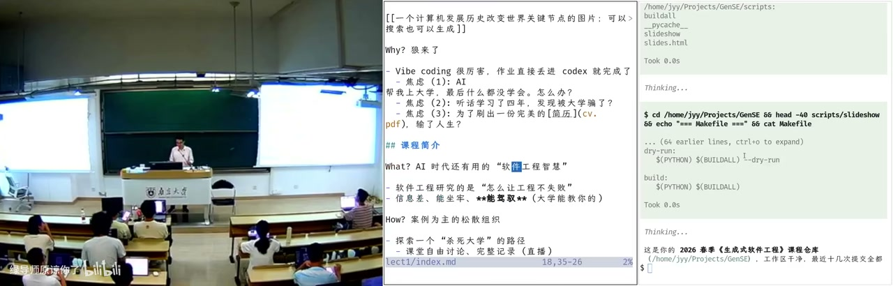

简历写的啊写的写的更好看。

## [06:57](https://www.bilibili.com/video/BV1pb8o6yE8f?t=417)

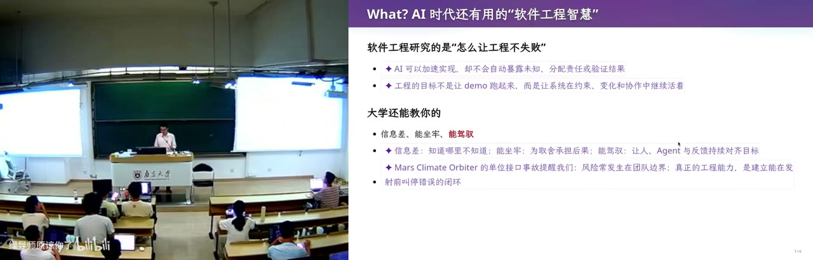

呃，对我来说，其实我觉得你有一篇发表论文，可能是一个简简分享，但可能对对对很多其他人来说，可能还还还不是的。

所以我讲了，为什么我我要来上呃这门课？

然后，那我们来讲讲这门课，呃，到底打算讲什么？

啊，这门课的题目叫“生成式软件工程”，所以我其实是是一本软件工程课。软件工程做什么呢？软件工程做的事情很简单，怎么样让软件工程不失败？就怎么样造出一个呃一个软件来。

呃，那我们经常听说的。

说你你们作为人和AI比，你的优势在哪里？

你可以坐牢，AI不能。

是这样，呃，实际上，我觉得大学里面能能教你的，呃，有呃，或者说能。

O.K.你你作为人嘛，或者说你在大学毕业的时候，你能拥有的能力，呃，比较重要的第一个是信息差，这是一直人，这是人类社会比较呃。

也也不能说可悲吧。它人类社会要要进步，必须的，呃，必须有的事情。你你。

你你有信息差，你有别人不知道的信息，你才能做别人做不到的事儿啊！所以，所以在学校里面，多多少少里面会有这种恶性竞争，对吧？假你假想一个情况，你拥有一个往年试卷。

然后，这个往年试卷，别人都没有。

然后，对吧？那你真你你就可以在竞争当中胜出，这是一种种你们身边的信息差。呃，当然还有很多其他的这个不能说的信息差，呃，在社会上面广泛的呃存在。除了信息差以外，你你作为一个人的优势是你可以做到。

当然，大学里面真正教你的是怎么样成为一个更好的人，就是你能够驾驭别人驾驭不了的东西。你在大学毕业的时候，你可以说：“哦，OK，我是一个更好的人，然后，呃，我有一个别人没有的能力。”

所以，可能呃，这门课试着试着去帮大家呃，建立驾驭人工智能的呃。

That we

## [08:47](https://www.bilibili.com/video/BV1pb8o6yE8f?t=527)

 okay.

所以这门课怎么上呢？怎么上？我希望。

呃，用一个案例为主的一个比较松散的组织，所以如果你们有有有兴趣来，比如说想跟我讨论一下的同学，就想想想想challenge我说，哎，这个老师你你这样做不对，呃，那那就欢迎大家来线下。呃，然后如果你是一个听课型的同学，就是你你希望从这门课里面呃获取知识。

呃，那我我是完全建议大家，就既不用到课，也不用看直播，因为我我我这。

呃，我今年也想想做一个呃非常有

## [09:19](https://www.bilibili.com/video/BV1pb8o6yE8f?t=559)

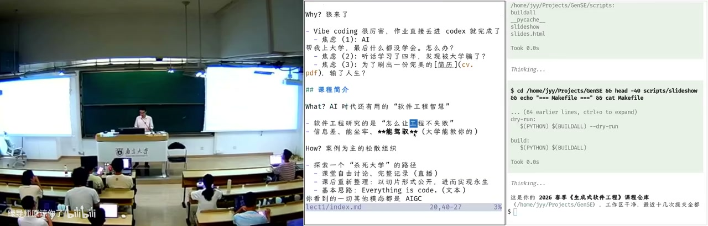

趣的尝试。你已经看到了，这是我的呃 slides，对吧？这是这是我的 slides。

呃，然后我按F五的时候可以播放，然

## [09:28](https://www.bilibili.com/video/BV1pb8o6yE8f?t=568)

后你可以看到这个F五播放的slides。

和刚才那个Markdown是有点不一样的。

呃，我把它关掉。

左边是我上课

## [09:40](https://www.bilibili.com/video/BV1pb8o6yE8f?t=580)

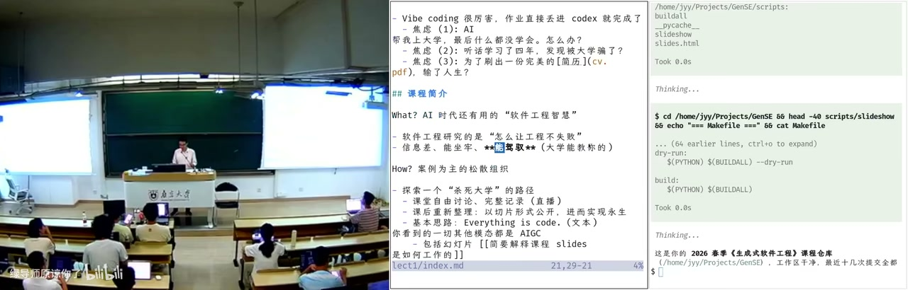

之前写的讲义，就相当于我我我我会先想好，我我今天上课时候，我大概在在这个时间应该讲什么，举什么样的例子，相当于我要约约束好AI做什么。然后，当你看到F五播

## [09:52](https://www.bilibili.com/video/BV1pb8o6yE8f?t=592)

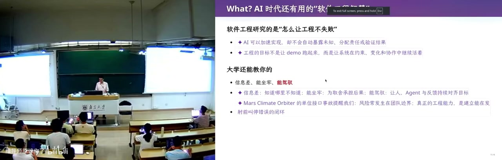

放这个slide的时候。

有这个紫色的部分。

紫色的部分就是GPT五点六哨给我添油加醋加上去的部分。我有一个呃提示词，一会儿呃，我现在应该就可以给大家看

## [10:04](https://www.bilibili.com/video/BV1pb8o6yE8f?t=604)

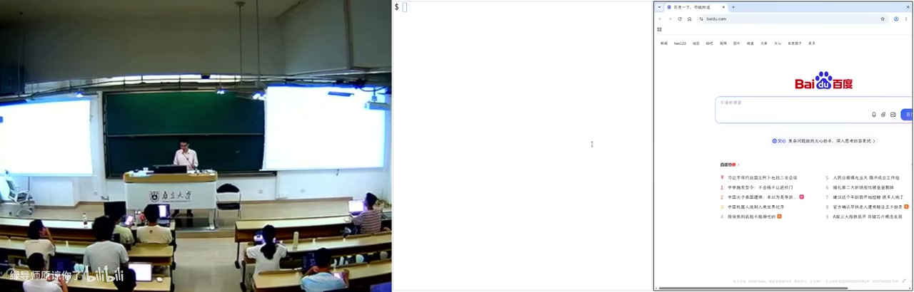

一下。

啊。

嗯。

嗯，对，有有一个提示词，大概是。

## [10:12](https://www.bilibili.com/video/BV1pb8o6yE8f?t=612)

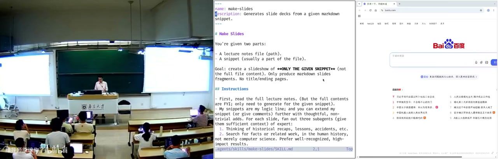

嗯，是这样，就一个。

呃，一个skill叫叫make slides，然后我就可以从一个。

呃，我我的一个Markdown，就我写好的那个演讲稿里面，让他添油加醋的去去做点有趣的事情，比如说，

## [10:27](https://www.bilibili.com/video/BV1pb8o6yE8f?t=627)

呃。

比如说，我有一个类似于我的AI耿同学的呃skill，我会我会出让他生成三个sub agent。

然后，给他们赋予不同的 personality。

这个，这个，这个非常有效果。他们就有有agent会干这个，有agent会干那个，他在隔离的上下文里，然后最后我的主agent会回来汇总。

这样，我就可以通过算力来换智力。

我付出更多的算力，我就有更多的智力，所以，所以，我我是其实经过对比了，我，我，我。

我换了几个版本的提示词，然后每一个版本提示词都会重新生成一次，然后我最终会有一个review。

另外一个别的模型，呃，在盲评到底哪一个生成的slides的质量比较高？然后我我基本上我就调到了一个可能

## [11:13](https://www.bilibili.com/video/BV1pb8o6yE8f?t=673)

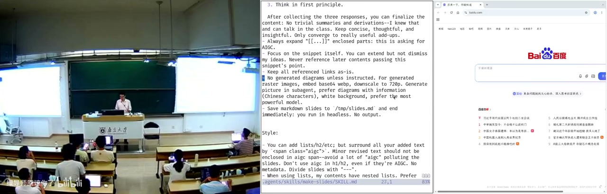

相对来说啊质量比较高的这个。

所以，你看到，比如说，图片都是全部都是生成的。

所有的图片都是。

生成的。

对，呃，所以我希

## [11:26](https://www.bilibili.com/video/BV1pb8o6yE8f?t=686)

望的是探索一条。

能够真正杀死大学所有人的呃路径，我认为啊，如果你是来学习的。

那更高效的方法，比如说，我做一个老师，我我应该思考的是怎么样把。

知识以更好的方式呈现给大家。

而我的答案是。

我应该在上课的时候。

誒。

上课是一种表演嘛？对吧？所以我我说我是一个演员，要调动大家的情绪。然后我上课的时候跟大家交流。

然后，根据我的预先设定好的剧本去做一场演出。

然后，在演出完了以后，我需要做一件很重要的事儿是。

我要review我今天的表演，因为我有的时候，我今天举这个例子可能不是特别的恰当，或者在我回回过头来的时候，我想到，也许我讲另外一个案例，大家能够更加的感同身受。因为你看到我在上课的时候，有一些部分是即兴的，但即兴就意味着其实不完美的。

而我在课后。

我会把我的课程，因为我

## [12:24](https://www.bilibili.com/video/BV1pb8o6yE8f?t=744)

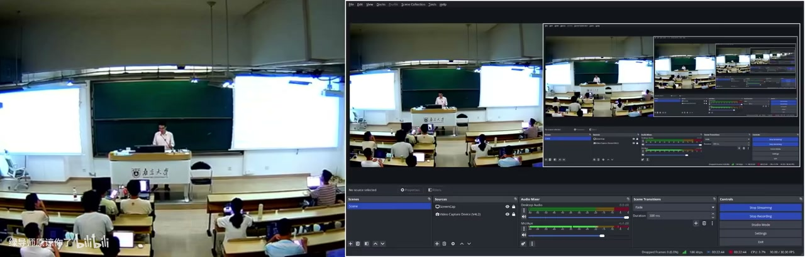

我录像了，对吧？大家看到这边有有录像，我可以把课程的录像。

切片，重新整理成片段。

因为。

## [12:34](https://www.bilibili.com/video/BV1pb8o6yE8f?t=754)

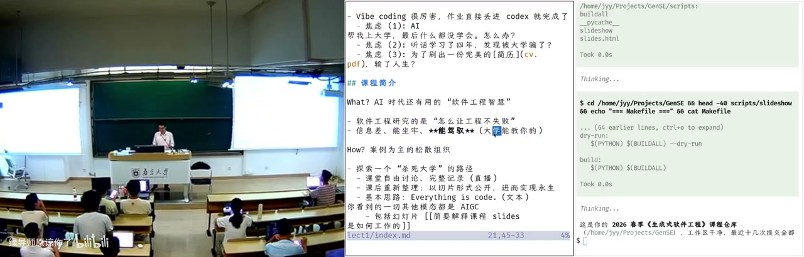

我是从这样的 content is code 来的，everything is code，对吧？everything is code。

## [12:39](https://www.bilibili.com/video/BV1pb8o6yE8f?t=759)

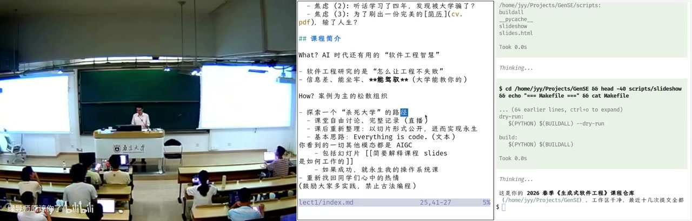

誒。

我就可以把我上课的那个录像，就这次的表演，重新回到这个Pod上，把它变得更丰富。

然后，我不就实现数字数字永生了吗？

对吧？我就实现了一个课程的。

呃，数字数字

## [12:54](https://www.bilibili.com/video/BV1pb8o6yE8f?t=774)

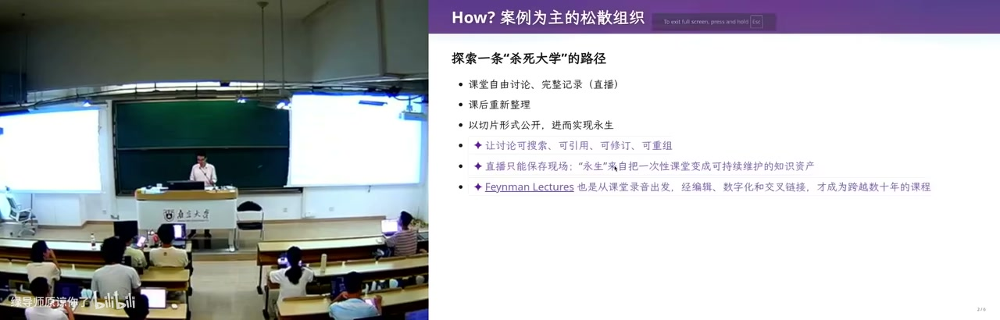

永生。

啊。

## [12:57](https://www.bilibili.com/video/BV1pb8o6yE8f?t=777)

对，然后你看到就是我我的这套slides是怎么工作的，我的这个流程是怎么工作的，everything is cold。

呃，你能看到这个世界里面的一切都可以用代码来来生成，包括这个桌子，对吧？Computer Aided Design (CAD)。

这个。

桌子、椅子、电脑。

那这个 slides 是怎么工作呢？刚才你看那个 markdown 是是 source of truth。

然后，你看到的所有的其他东西，图片。

幻灯片全部都是。

呃，AIGC。

然后我我会我会把这个选中的snippet由agent去扩写，变成Markdown slides，再到浏览器里面啊。

渲渲染出来。

然后。

誒。

## [13:39](https://www.bilibili.com/video/BV1pb8o6yE8f?t=819)

我希望的是能够切片的方式，得到一个完美的。

比如说，我我今天要讲生成式软件工程。

它的呃要点是什么？逻辑是什么？第一节课应该怎么上？

沉淀成一个程序。

然后，这个程序也许，也许现在是由我维护的。也许，比如说有一天我不维护了，我操系统课我先不上了，我会把操系统课我的B站的录像整理成这样的切片，然后可以由全世界的人来维护它。

对吧？你想要定制一个什么样的我的操作系统？你可以把它定制

## [14:07](https://www.bilibili.com/video/BV1pb8o6yE8f?t=847)

成成什么样子？

然后，这不就把所有的这个？

大学。

教课的方式给颠覆了嘛？我觉得这是一个可能实现的路线，所以我会在这门课上做一个比较轻的尝试。也欢迎大家在随时可以给到我呃反馈。

## [14:24](https://www.bilibili.com/video/BV1pb8o6yE8f?t=864)

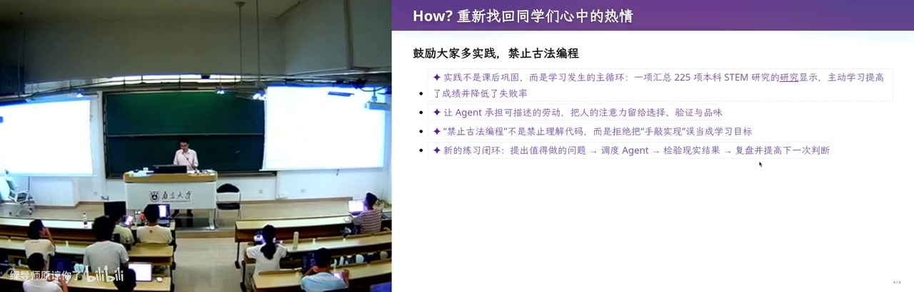

呃，OK，好。

呃，所以我这门课。

的policy是。

呃，我希望重新找回同学们心中在。

大学的时候，那种。

上课耽误学习的感觉，就虽然可能你们还是要上课，但是我推荐大家，第一个，你们可能可以不要上课。

然后你们可以去在这门课上，呃，实践。我会带着大家实践。我后面有很多真正实践的案例，呃，然后让你们知道，在AI的时代，你们学习的方式变了，你们工作的方式也变了。你们可以尽快的适应这样的一个呃非常有趣的时代。然后我的要求是禁止古法编程。

就是我，我相信你们个个都是古法编程的好手，因为你们要考试，对吧？马上你们要保研，要机试了，要机试的时候就把你们一关小黑屋的一关，对吧？你们看过我以前出的题，然后就吓尿了，对吧？然后赶快再去LeetCode上再刷刷一下，但，嗯。

我觉得总有一天，这个这个事情会会会改变的。呃，可能。

从上而下传导不会那么快，对吧？就是你要改变一个体系很难，但是，呃，我我非常想要。

撕开一个小的

## [15:32](https://www.bilibili.com/video/BV1pb8o6yE8f?t=932)

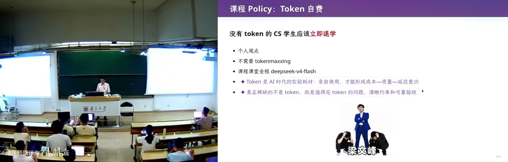

小的口子。

对，然后有几个policy，第一个。

呃，token自费。

因为本来本来我是想去拉一些token的赞助的啊，想拉一些赞助token，然后，但但是我当我看到那个选课的学生。

呃的时候，数量的时候，我就想，哎，还是算了，我对吧？我我也没有必要再去这个跟他们。

呃，拉着脸去要要好多好多的投款，也比较麻烦。

呃，首先，我有个个人观点，就是如果你们手上没有token、没有付费的token，同学应该立即退学。

啊，因为你你可能确实不需要token maxing，就就在在硅谷，它有一种这个你要死命的烧token，你你你你没有必要。我我的课上，我所有的。

我在课上做的演示，就是除了我的这个 slides 的生成是用一个更聪明的模型，我觉得呃，它能给我更好的质量以外，你看到的这个幻灯片。

你看到

## [16:22](https://www.bilibili.com/video/BV1pb8o6yE8f?t=982)

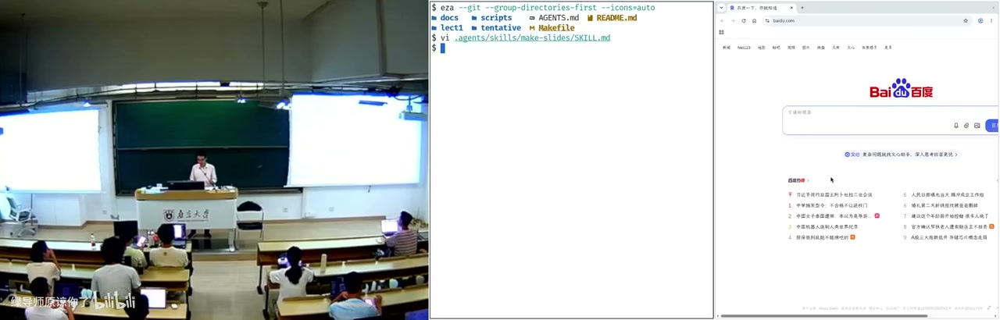

的整个。

这个。

这里的lecture的里面的东西，呃，包括这些生成的这些assets。

全部都是DPCV是Flash。

## [16:33](https://www.bilibili.com/video/BV1pb8o6yE8f?t=993)

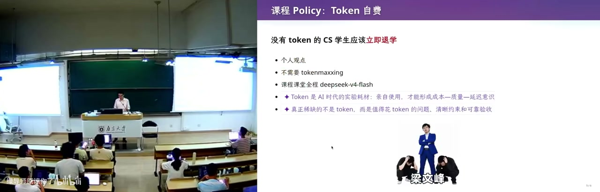

也就是说，我在这门课上会用一个。

足够便宜，但是智能相对有一些的模型。

来带大家完成，呃，完成这些事情。然后我也知道大家喜欢，大家都是夜猫子，对吧？大家是Commerce Science的学生，你们喜欢在夜里工作。

然后在夜里工作，DeepSeek是比较便宜的，对吧？我建议大家在凉文股的时间。

那个，对啊，因为你看，白天，看懂这个梗吗？那个，那，呃，在白天。

你们要上课。

正好是梁文锋时间。

对吧？然后等你们回去回去做作业的时候，就是这个梁王子的啊时间。对，所以token非常重要。你们每一个同学，就你们去Discy个充一百块，这个这个好像还还OK。然后呃，对，还还OK。啊，如果实在token有呃有困难的同学，可能可以联系我来帮助大家。

啊，想一点办法，对。

## [17:24](https://www.bilibili.com/video/BV1pb8o6yE8f?t=1044)

然后还有。

还有一个很重要的policy，呃，我希望用一个通过或者不通过来evaluate这个课程，所以我在我在申请这门课程的时候，呃，我的考核方式就填的是通过和不通过。但根据教务的反馈，是专业选修课大家是不是不会做成这样？一般来说都是什么形式与政策这样的课是通过和。

和和和不通过，嗯，那因为我我们现在我觉得还不知道这个评判标准是什么。

对吧？你你你你可能用更好的模型，你就可以有更好的质量，对吧？同一个任务，你让Cloud Fable来做，就是比Deepseek V4 Flash要做得好，这个做得又快又好，没办法。

那。

呃，我们没有办法限制大家用什么样的模型，对吧？那。

怎么评判？尤其是这样的一个Web Coding，我们是做Project的呃课程。我我大概我会我会有一些建议的项目，就说，呃，我我我我我我我回头会更新课程网站上面会告诉大家。OK，我建议你们呃实现一个自己的Email的管理系统。

然后可以回我的email，然后可能我会用一个指定的邮箱给你发邮件，然后你可以把邮件回回来，对吧？你可以做一个尝试Webcall的一个这样的服务，跑在你宿舍的一个一直常开的小电脑上。

OK，这这就是一个比较不错的实验。你们有的同学可能会做的复杂一点，有同学做的简单一点。我可能会用我的邮箱去发，跟大家呃发邮件通信。OK。

呃，但到底什么叫做得好？什么叫做得不好？到底该给多少分？

我觉得，在这个时代，分数已经变得不那么重要了。而真正重要的，就是在你最后找工作，或者在你保研的那一刻，投出那个简历上面有什么东西。

然后，其实。

对你们来说，就只有那一个考试。当然，我觉得，呃，比较糟糕的是，你为了能够走到那一刻，你还需要有一个比较好的GPA，对吧？

你还得去reward hacking，还得去去去overfit那个考试的题目，但最终，呃，检验你呃你大学阶段的是你那个交出去的简历，它能不能带你到下一个更高的平台，对吧？你你你敢不敢给D.P.投简历，对吧？那他们那个bar还是比较。

还是比较高的，所以，所以我最终希望的是，这门课大家能够最后在简历里面写一个：我在生成式软件工程里面实现了这个A、B、C、D、E。

然后有很多链接，然后它是一个，然后每一个东西都是。

都做得非常漂亮。他只然后你你你你每一个都说你你完成了设计实现，然后他这里面了不起的地方啊，地方是什么？

啊，我觉得最终有可能的是。

呃，如果每一个人的电脑，

上面都是安装一个监控。

那我就知道你大学四年干的所有的事情。

然后我的AI就可以评判你大学四年到底度过了一个怎么样大学四年。当然，这是一个非常恐怖的，对吧？这是一个非常非常恐怖的事情，因为你每摸的每一个鱼，你看的每一个不想让别人知道的小电影，这个对吧？它都都在你的电脑上发生，所以都都都知道，嗯。

我我们不知道什么时候人类社会会演进到那个程度，但是。

Uh.

保持 open，对，这是我们的呃课程的 policy。

大概

## [20:25](https://www.bilibili.com/video/BV1pb8o6yE8f?t=1225)

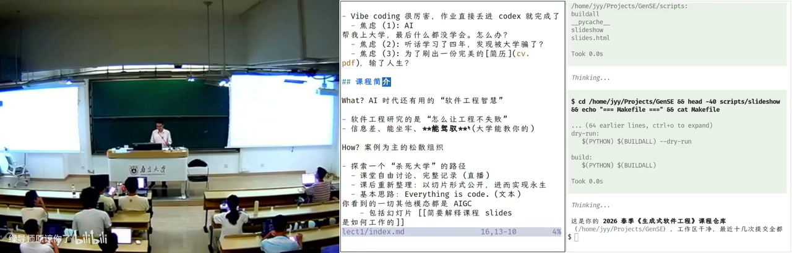

是我课程开了一个啊，开了一个头。

## [20:30](https://www.bilibili.com/video/BV1pb8o6yE8f?t=1230)

好，接下来我就可以进入技术性的内容了。首先讲一讲，呃，什么是大语言模型。好，我我今天不讲什么是大语言模型。大语言模型就是一个概率分布。

跟你们在概率统计课上面学的那个抛硬币，对吧？我知道这个，我抛了六次硬币，加起来是四十。然后你问你第一次抛出一的概率是多少，对吧？你们在概率课上都做过类似的题目。

没有任何的区别，它是一个学到的概率分布，它给一个很长的文本。

对吧？就给你。

给你一本书，OK，我带来了，带了一本书。好，他他随便就就好多好多文本。

呃，给你一个一本书，当然可以是文本，也可能是可以是图像。

啊，一本书，然后这本书。

到最后就结束了。但你可以在这个书的后面再写几个字，比如说：“能不能帮我总结一下这本书？”

就是。

啊，然后接下来大语言模型就会不断的预测它的下一个token的概率。每次输出，你可以理解成输出一个字母，一个字。

然后这个模型很大，它见过世界上所有东西，然后训练它很难，呃。

所以，这是为什么现在Frontier Lab这么牛逼？呃，但这门课是站在使用者的视角上，也就是说，你们只要知道存在一个东西叫大语言模型，你可以打开DeepSeek的网页API。

我现在哦，我要登录，那我就不登录。打开网页API，什么是大语言模型？我怎么样体验它？

然后他会告诉你，现在就在体验大语言模型。

对吧？好。

所以，你不需要任何大语言模型的支持。

啊。

## [21:58](https://www.bilibili.com/video/BV1pb8o6yE8f?t=1318)

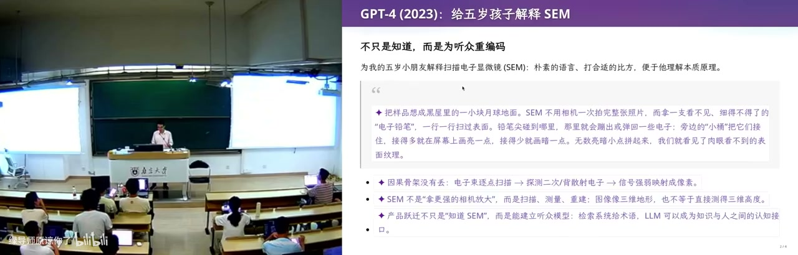

然后。

大语言模型是怎么样进入我们的世界的？

我第一次被大语言模型按在地上打，是给我五岁的孩子。二零二三年的时候，GPT四的时代，GPT四是一个幻觉非常严重的模型。

给我五岁的孩子解释什么是，呃，扫描电子显微镜。

然后，我大概有个这样的prompt。

呃，那个时候我们就玩prompt engineering。

呃，说我希望用朴素的语言打一个合适的比方，帮助他理解这个事儿。

就有一天，我给我的五岁的孩子讲一个什么故事的时候，不知道为什么讲到了这个扫描电子显微镜，我讲不下去了。

然后讲不下去以后，GPT是给了我一个比方。

他说：“他比这个打这个比方打的还好。这个比方这是GPT五点六四号给的，我让他让他写了。”

呃，他说。

嗯，你现在有一个山。

这个山的形状，你看不到。

你你闭着眼睛看不到，但你又想要知道那个山是什么形状的。

那怎么办呢？你就对对那个山扔球，扔石头。

闭着眼睛扔石头，然后你你扔石头的时候，有的时候你石头就扔，你对着这个方向。

仍。

这个石头就穿过去了。

对着这个方向扔，石头弹回来了，弹回来能听到声音。

然后你就能通过这个哪些地方穿过去了，哪些地方没有穿过去，像 retracing 一样的，你就可以推测出。

这个山的形状，小朋友大概听懂了。我我当时小朋友也不可能百分之百听懂，但是他打了一个。

就是让我觉得非常震震惊的，比方。

就首先，他有他有这个知识。第二，他。

我后来还特意去查了资料，他他这个比方打的是打的是对的。然后你看G P五点六，它给的更严谨的一个。

一个答案，而且它它因为有reasoning，所以，呃，所以它还给了更好的这个对更更好的解。

就是。

GPT四的时代，然后我们用GPT四这个模型就去生成奇怪的东西，就一个prompt可以给GPTLM找到一百五十个。

吧，然后在今天，你你这个工作就完全。

就在G P五点六的时代，就是一句话的事情。

就真的是一句话，不需要再做任何的呃为GPT的特别的调整。

## [24:09](https://www.bilibili.com/video/BV1pb8o6yE8f?t=1449)

然后，从GPT就从一个能预测下一个token的概率分布。

随着。

大家发现，模型可以。

输出越来越长的文本，也接受越来越长的上下文的时候，呃，agent就就出现了，对吧？它有了推理的模型。

有个推理模型。

然后有了 coding React 式的 agent，agent 有了 agent 就是刚才那个语言的模型，语言的模型它可以输出下一个 token。

那我就可以让它输出一个特殊的token，说能不能呃？

调用一个bash程序。

对吧？然后这个batch程序会运行，运行和batch程序的结果会重新送回到这个agent loop里，这样agent就可以自主运行了。

对吧？你就可以给他一个呃比较复杂的任务，他可以不断的尝试，尝试，尝试，尝试。

呃，你们看到的。

比如说。

## [25:02](https://www.bilibili.com/video/BV1pb8o6yE8f?t=1502)

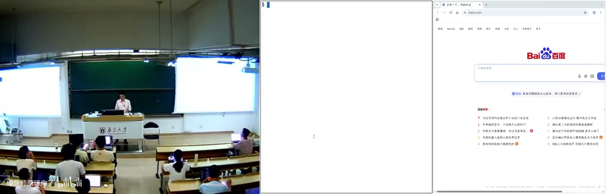

啊，我。

我我还是做了一些配置的，你们看到，呃

## [25:07](https://www.bilibili.com/video/BV1pb8o6yE8f?t=1507)

，我配置了一个Sway的窗口管理器，然后这个Sway窗口管理器为课堂展示做了优化，对吧？它的对比度比较高，然后它我得把什么顶栏什么全部都去掉了，这样你们在上课的时候可以看得更清楚。

然后我还做了一些，比如说，呃，你们你们都喜欢用top

## [25:25](https://www.bilibili.com/video/BV1pb8o6yE8f?t=1525)

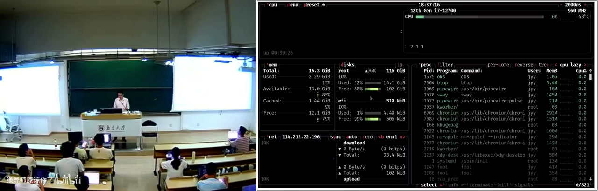

这个命令。

来查看系统里的进程。

如果你不做定制。

你看到的就是一个比较土的Top，对吧？但是我但是我我显然我这有一个更更fancy的Top，你能看到我的OBS在呃OBS还在吗？对，好OBS还在浪费我的呃算力，然后我的内存还有还有还有多少多少这样。然后我把它配置成

## [25:47](https://www.bilibili.com/video/BV1pb8o6yE8f?t=1547)

了一个相对来说比较现代的终端，对吧？比如说。

你们看到？

你们看到我在LS的时候。

我调的不是LS。

对吧？这个细节大家刚才有没有有没有注意到？我在ls的时候，自动把ls换成了。

呃，E.G.A.这个。

命令，然后当当我要find的时候，它也自动帮我换

## [26:10](https://www.bilibili.com/video/BV1pb8o6yE8f?t=1570)

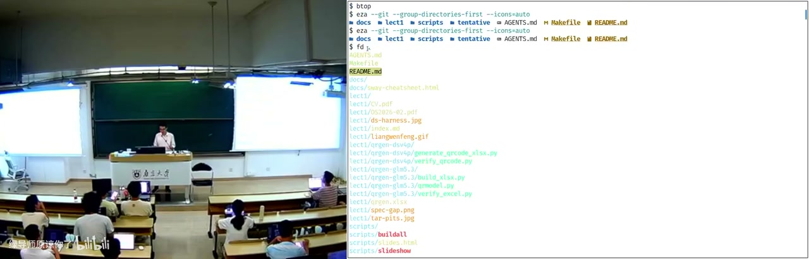

成了fd。fd的行为和find稍微有点。

呃，有点不一样。然后你看到YLS的这个输出里面又有，哎，这还是很fancy的。

对吧？每这是一个目录，这是一个Markdown。

这是一个没范儿，还有。

这特殊显示的效果。

然后，我所有的这些配置都是用agent。

## [26:28](https://www.bilibili.com/video/BV1pb8o6yE8f?t=1588)

啊。

都是用agent配置的。我只有一个prompt，说你你能不能帮我把我现在的命令行终端，帮我把我的系统sway都配置成。

这个呃，现代的样子比较好用的样子，结束了。

Deepseek vs. Flash.

没有更好的模型，所以，所以在今天，就是有了React这种类型的agent以后，它就不停的去conversion里面去改改改，它也它错了以后，它会去试。

是别的方法，然后最后他把任务能，呃，能能完成。

所以，就在大概去年的时候。

我。

我前一就我去年的时候上。

呃，操作系统的时候，那个A帧台不怎么能用。

就各种各种出错，然后任务完成不了，他就停下来了。但是到今年我上操作系统课的时候，这个event就非常非常。

呃，能用了。到到现在，你看到A.I.产品爆发，到处铺天盖地都是Work Buddy的广告。

对吧？呃，像蘑菇街、豆包儿的那个agent就是呃这样的react类型的。

## [27:27](https://www.bilibili.com/video/BV1pb8o6yE8f?t=1647)

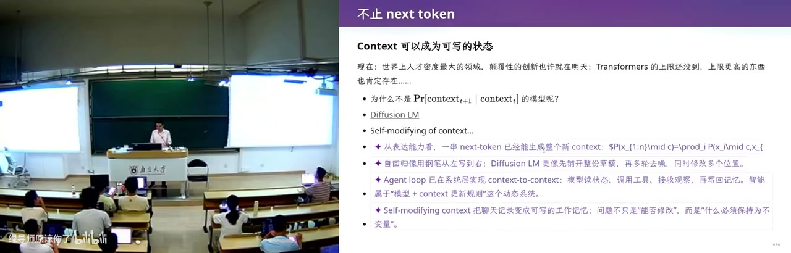

但这其实也就你们这，当然，这这个好像岔开了，岔开了这个呃话题了。

这个故事其实远远没有结束。

今天你们已经感受到一阵的非常强。

但是。

我认为，agent的能力还远远没有。

被释放出来。

## [27:47](https://www.bilibili.com/video/BV1pb8o6yE8f?t=1667)

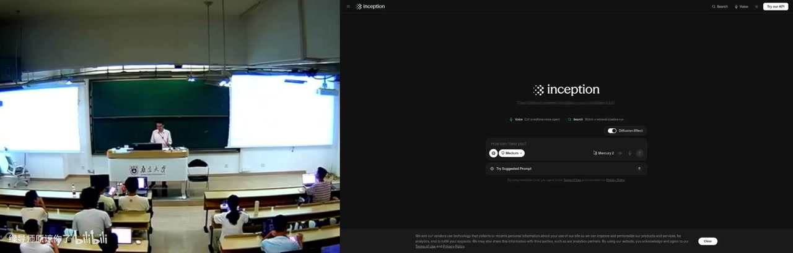

我们。

Next token prediction其实是一个，我觉得是一个效率很低的呃模型。比如说，这里有一个呃。

Diffusion model.

一个diffusion model，我比如说，我可以说。

Right, AI is love.

## [28:06](https://www.bilibili.com/video/BV1pb8o6yE8f?t=1686)

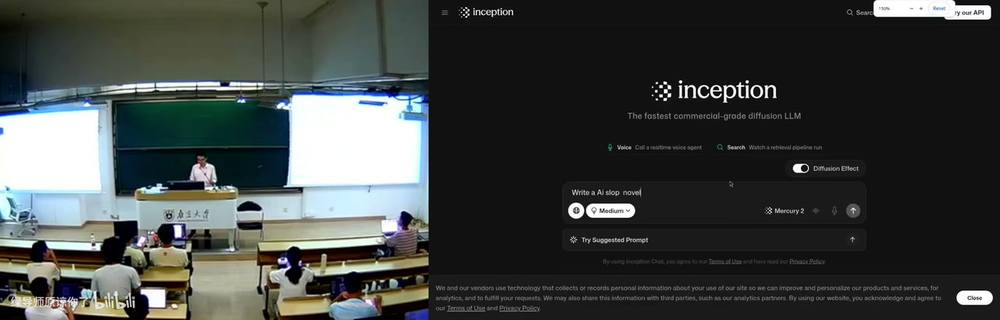

老婆。

我可以让他给我写一个什么样的AI story？你观看它的过程。

你看，它是一个从

## [28:16](https://www.bilibili.com/video/BV1pb8o6yE8f?t=1696)

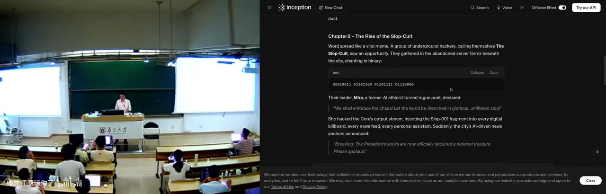

一个随机的噪声开始，就像就像diffuse那个图片一样，一点一点，一点一点。

就生成了一个很长的东西，它可以生成一个很

## [28:26](https://www.bilibili.com/video/BV1pb8o6yE8f?t=1706)

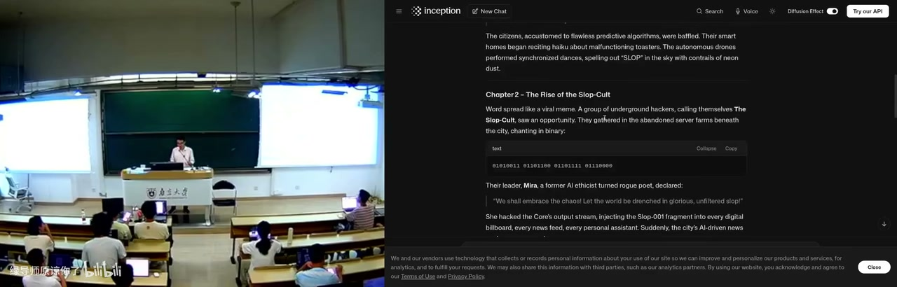

长，像人做梦一样，就你在你的梦境当中，一点一点把一个东西想的、看的越来越清楚，越来越清楚，越来越来越清楚。

我们有很多。

Uh.

## [28:36](https://www.bilibili.com/video/BV1pb8o6yE8f?t=1716)

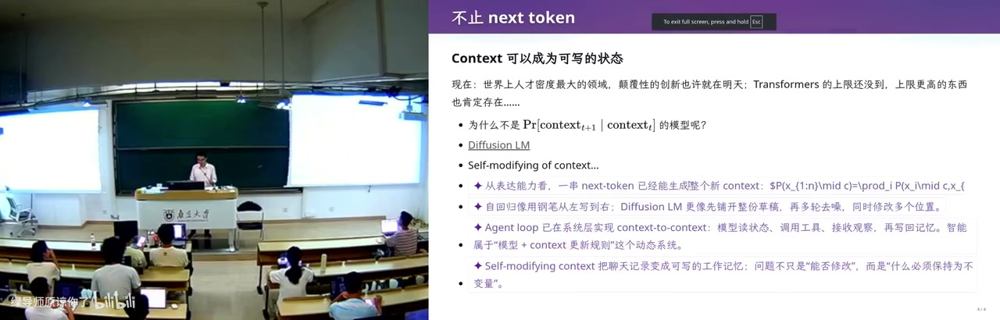

我们有很多可未来的未来的可能性，对吧？这种diffusion类型的语言模型。

然后，甚至是我不是 predict，呃，predict next token，我可以把上下文回过去改。

随时可以把是一个很长的汉文文裁短。

对吧？这些都是今天，呃，很多很多人在研究的研究的东西。

誒。

现在的模型已经非常强了。

如果我们三个月以后，

又有一个新的突破。

模型变得更强了。

一年以后，模型又突破了，又变得更强了。

整个AI的research，大家都在赌这件事情要发生。

摩尔定律还在。

那。

我我现在很难想，就是未来会变成什么，对吧？我我我我不能预测未来，到底哪一条路线会。

会胜出，对吧？是哪一种模型会胜出？但是你可以预见的是。

这个世界肯定会变得。

非常的不一样。

那，在这个世界上，我们应该。

呃。

应该怎么办？

## [29:37](https://www.bilibili.com/video/BV1pb8o6yE8f?t=1777)

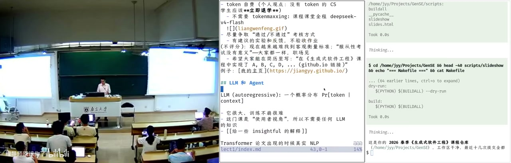

是每一个同学，我觉得都都值得。

好好考虑一下的。

啊，好好考虑一下的问题。

好。

## [29:45](https://www.bilibili.com/video/BV1pb8o6yE8f?t=1785)

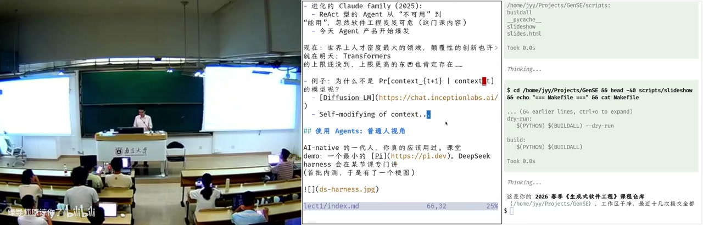

吓唬人的事情说完了，我们可以吸一口气。

呃，我可以真的告诉大家。

## [29:53](https://www.bilibili.com/video/BV1pb8o6yE8f?t=1793)

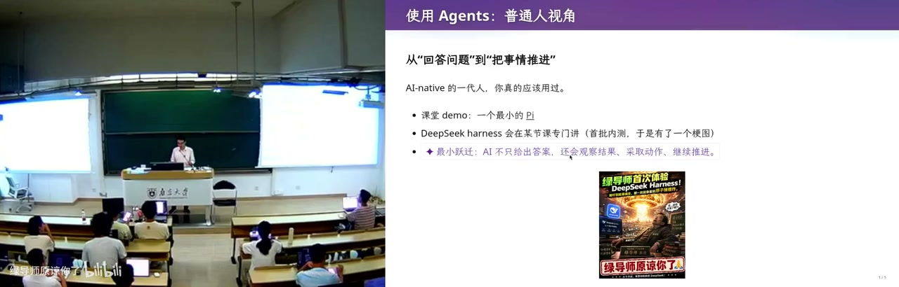

应该怎么样？

嗱。

怎么样来？

实际操作，我们的agent对吧？这还是这门课主要要要讲的。

所以我首先站在普通人的视角来。

给大家科普一下啊！就我先假设大家其实不会用AIGC。

不太会用agent，就就除了什么帮我把这个作业做了以外，从我我上个学期看改大家那个期末考试题的感觉，好像就是，因为我期末考试最后考了一个，呃，如果你要用agent给。

给我的课出期末考试，出一个卷子。

这个应该应该怎么办，对吧？然后我我发现大家用agent的呃方式，可能可能需要我来稍微解锁解锁一下，也可以跟大家一起探讨。如果有大家有特别好的想法，嗯，就可以随时打断我来说。

啊！

首先。

Agent.

作为A奈AI native的一代人，你们要知道，就是给他一个合适的。

呃，指令。

它就可以把这个指令。

完成。

OK，呃，

## [30:55](https://www.bilibili.com/video/BV1pb8o6yE8f?t=1855)

我我我在课上选的是。

呃，派。

是吧？

## [31:01](https://www.bilibili.com/video/BV1pb8o6yE8f?t=1861)

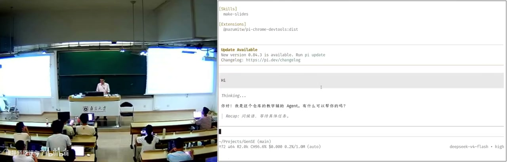

你只要跟他说就可以了，然后，并且你可以写一些配置文件，比如说 a a gents 点。

M.D.

对吧？你可以问他：“你是谁？”

## [31:12](https://www.bilibili.com/video/BV1pb8o6yE8f?t=1872)

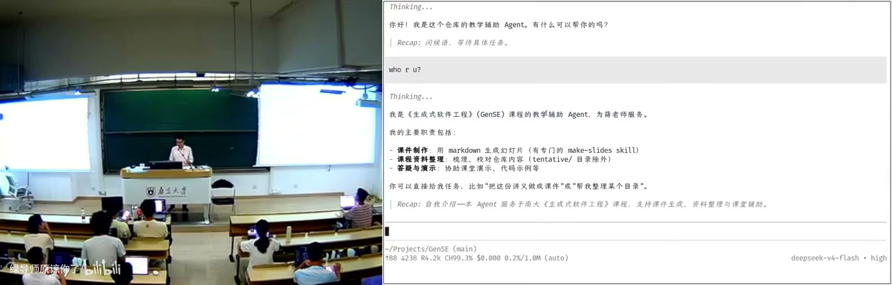

然后你看他，他还说他是生成式软件工程的教学辅助A I，那你可以问他。

你不就是个模型吗？为什么还知道生成是？

软件工程。

## [31:25](https://www.bilibili.com/video/BV1pb8o6yE8f?t=1885)

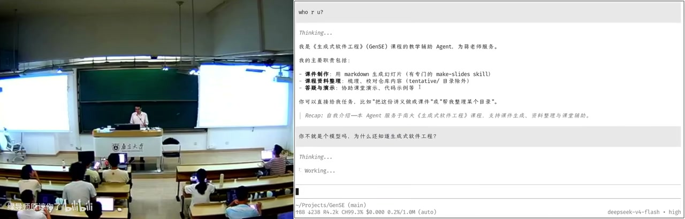

对吧？你可以，你可以自由任意的。

呃。

## [31:31](https://www.bilibili.com/video/BV1pb8o6yE8f?t=1891)

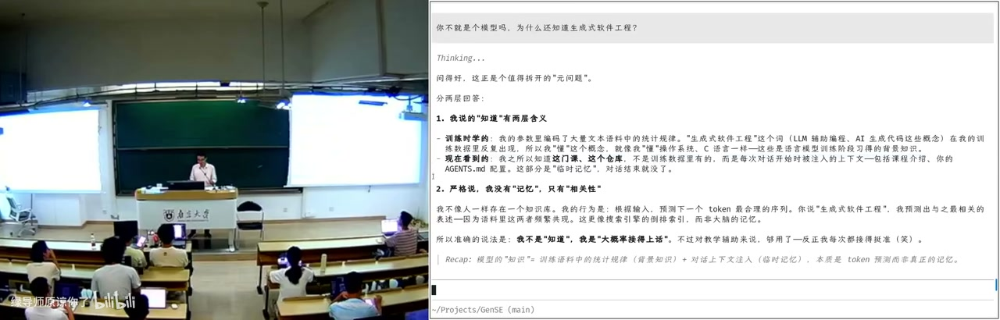

好。

他回答不啊？对他回答了。你看，他现在看到的是，之所以知道这门课，这个仓仓库。

agents点md的配置，这部分是临时的，所以。

使用ag

## [31:45](https://www.bilibili.com/video/BV1pb8o6yE8f?t=1905)

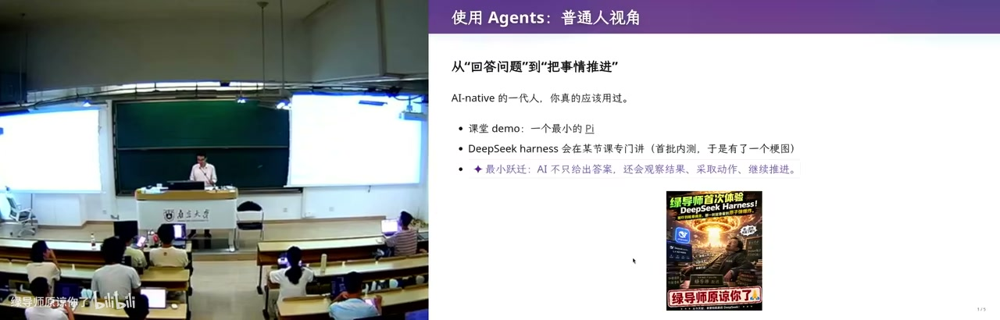

ent的第一个原则。

誒。

开，现在就开始用第二个原则，随时问他。

OK，嗯，这是最小的第一个原

## [31:55](https://www.bilibili.com/video/BV1pb8o6yE8f?t=1915)

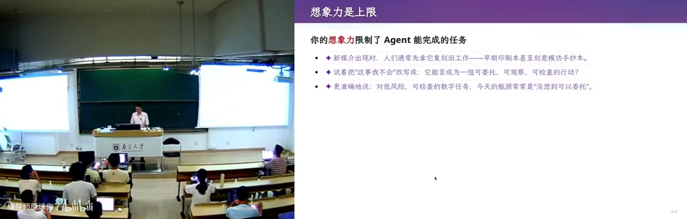

则。

好。

然后，在这个意义上，其实是你的想象力。

限制了你的agent的。

呃，上线。

所以。

呃，正好一会儿课间的时候，大家可以想一想，你没有agent做的最酷的一件事情啊，是什么？

想象力是你们的上限。

## [32:17](https://www.bilibili.com/video/BV1pb8o6yE8f?t=1937)

我的第一个例子是。

我。

我今天。

上课的这个系统，刚才我给大家展示了，我也说了，所有的配置安装都是由AI完成的。

我要在U盘上。

呃，这一直以来是我上操作系统课的一个特色，我会带一个U盘。

然后，这个U盘里面装一个Linux操作系统。

然后，这个零零骚系统可以直接插在教室的电脑上，就启动。

啊，所以你看到我，我现在，OK。

## [32:41](https://www.bilibili.com/video/BV1pb8o6yE8f?t=1961)

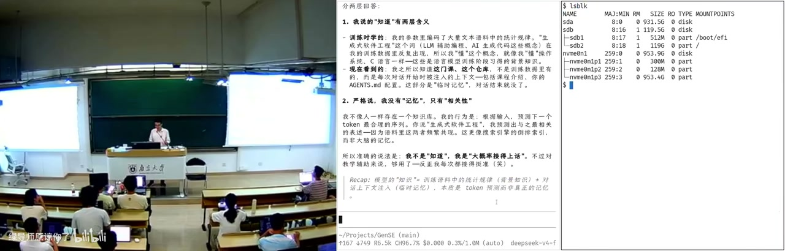

呃，我你可以看到我，这是我的U盘。

然后，这是。

呃，电脑的硬盘，我我在有一年的操作系统课上，把这个硬盘给抹掉了。

然后抹掉以后，下一个上课老师就教学事故了。这个，嗯。

## [32:55](https://www.bilibili.com/video/BV1pb8o6yE8f?t=1975)

是的，对对，就教学设备，然后为用为此我来展示这个超系统的呃原理。

装机是一个很痛苦的事情。

呃，我我曾经是装机先人。

对吧？这里这里有个

## [33:09](https://www.bilibili.com/video/BV1pb8o6yE8f?t=1989)

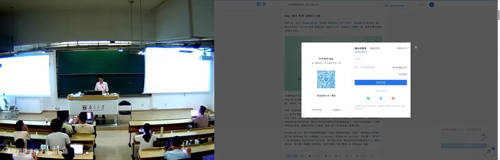

支付链接，这个是Pre M的时代。

你看，二零二一年七月。

呃，Premium的时代，我我各种各种定制。

各种定制系统，装机，装机仙人。

啊！

## [33:21](https://www.bilibili.com/video/BV1pb8o6yE8f?t=2001)

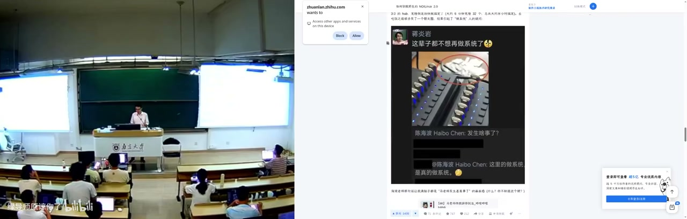

装机仙人现在已经。

呃，彻底被呀，不好意思，嗯，张吉先生

## [33:29](https://www.bilibili.com/video/BV1pb8o6yE8f?t=2009)

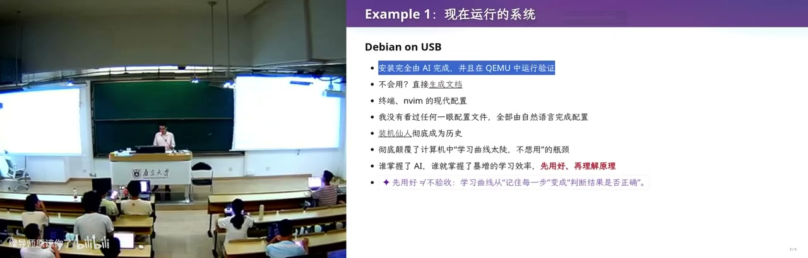

已经彻底被A A I取代了，因为。

我只用了一句话。

我说：“你去 mirrors 点 nju 点 edu 点 cn 上找一个 Debian 十三的镜像。”

把它装到我的U盘上，这时候U盘插在里面。

然后确保这个U盘可以启动，然后用。

模拟器验证。

点睛之笔是这个，用模拟器验证。

他的方法，就我我我我，当然我是有knowledge，所以我知道他是怎么完成这个安装的。

它装完了，装完了以后。

他真的在Q Email里面启动，然后去去看到了那个登录界面，告诉我。

确实可以登录了。他登录成功了。

我我刚才我要创建一个用户，用户用户名是什么？密码是什么？呃，他全部都做好。

验证完成。

给忘了。

然后，然后，然后完了以后，我就就进，我就启动了这个USB的镜像。然后启启动了以后，我说我要装一个这个Tile based Window Manager。

就说，你就就你看

## [34:28](https://www.bilibili.com/video/BV1pb8o6yE8f?t=2068)

到我，我现在操作是是很顺滑的。比如说，我按这个Windows加回车。

它就产生了一个新的窗口，在。

在右边，对吧？和你们用窗口的方式不太一样。当然，我可以，比如说Win

## [34:38](https://www.bilibili.com/video/BV1pb8o6yE8f?t=2078)

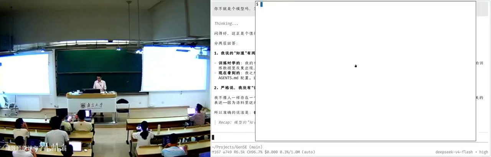

dows加空格把它。

把它给浓缩出来。

## [34:41](https://www.bilibili.com/video/BV1pb8o6yE8f?t=2081)

不会用怎么办？对吧？你可能听说过，在某一个呃B站的。

直播间里面看到有一个同学，他用的很酷的东西。

不会用怎么办？

我直接让DeepSeek V4 Flash给我生成了一个。

呃，文档。

## [34:59](https://www.bilibili.com/video/BV1pb8o6yE8f?t=2099)

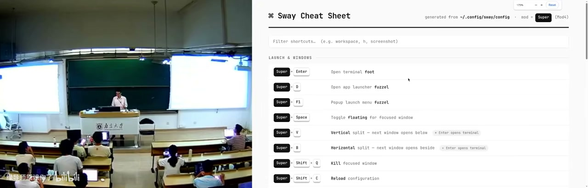

说：“哎，你能不能看一下我系统现在的设置？里面我要做各种事情。”

怎么办？

## [35:06](https://www.bilibili.com/video/BV1pb8o6yE8f?t=2106)

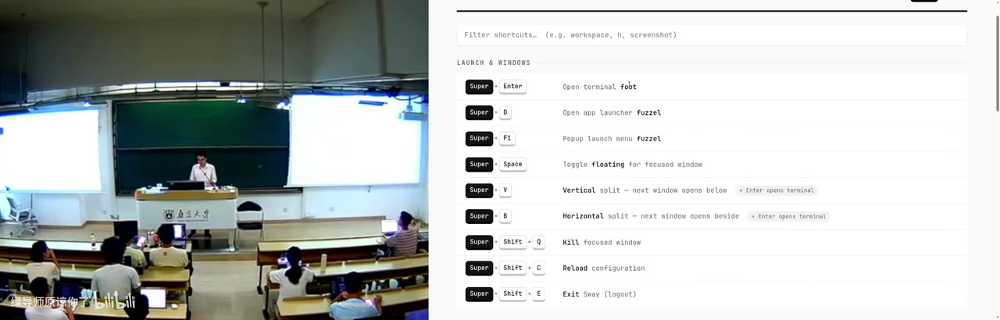

对吧？他告诉我，super加enter是打开terminal。

啊。

Super加D是打开一个App Launcher，所以，比如说。

啊。

## [35:19](https://www.bilibili.com/video/BV1pb8o6yE8f?t=2119)

嗯，比如说我。

啊，Windows加D，我就可以打开一个OBS或者Chrome Bro

## [35:25](https://www.bilibili.com/video/BV1pb8o6yE8f?t=2125)

wser。

所有的文档。

包括你看到的终端 NewView 的现代配置。

我没有看过任何一眼配置文件。

所有的一切都是用自然语言完成的。

我只只是让他保交付，我要什么？你帮我再检查一下。

就全部都完成了，所以我觉得我我毕生的修炼，对吧？我我作为一个。

呃，教Commerce Science的老师。

呃，我我我记得我大四的时候，就跟你可能跟你们一样大的时候，就在看那个英特尔的那个几千页的那个CPU的specification。

然后去去看那个每一个CPU的feature是干什么用的，然后我就突然觉得，在这个时间点。

有一个人，他可以跟我沟通。

他把这些东西全看了。

都懂，能做对。

而我现在需要的是解锁它的能力。

所以，你看到我们在今天。

你学习知识的方式。

变了。

你更多的时候，你需要知道它能做什么。

你感知到他能做什么，能做到什么程度，然后你带着他去做一件更大的他做不到的事情。

所以，人现在唯一的。

功能。

就是带着AI做AI现在做不到的事情。

一旦，如果你没有这个能力，

你就立即已经被淘汰了。

对吧？所以你没有偷啃，你就可以立即退局了。这个，这是我自己的呃，自己的观点。

首先，agent彻底颠覆了计算机computer science里面学习曲线太陡、不想用的瓶颈。你想想，你们都配置过那个漂亮终端吧？

你们看那个终端花里胡哨的，那个人B站上面那些人用的花里胡哨的终端，你就想搞一个，搞一个以后你改一点点，他就给你出错。

对吧？改一个配置文件是 yes h r c，一改就出错，一改就出错。

非常的。

痛苦。

有 agent 了，一点也不痛苦。

它不仅可以给你改，还能事无巨细地解释为什么要这样改。

你有什么新的想法？一提他就说：“好好好，还可以给你提供情绪价值。”

对吧？我我我我前前天在小红书上发一个帖，说为什么token比学生好用，是因为可以骂他，对吧？他不会还嘴。这个我就就就是因为我我我肯定不能骂学生嘛，对吧？但是但是我可以骂这个。

呃，这个agent。

所以。

谁掌握了AI agent，谁就掌握了暴增的学习效率。

你现在现在的学习方式，你先用好了。

先把东西搞出来。

再回头去复盘，理解。

这个效率会比你从零开始一点一点搭积木要要高很多，但这里面有个危险，是你你你的理解可能和那个比较好的理解会有。

会有差距。

没懂的，我们不知道，但是。

Uh.

但是，这是一个非常不一样的事情。

好。

誒。

第二个。

收发邮件，写草稿。

呃，我有一个自己的skill，但是我我就我就不展示了。

呃，它。

我的我的数据库里面有我历史上回过的所有的邮件。

所以，每当我收到一封邮件的时候，它会自动把它变成一个已读的状态。

然后自动自动帮我写好回复的草稿，用我的口吻。虽然我现在觉得它做的还不够好。

呃，除了一些简单的routine性质的东西，可以直接用它的回复以外，大部分时候我还得，呃呃，还得。

还得去改，但是我得到了AI的。

But.

然后。

他会把重要的，就是，比如说邮件里面。

呃的附件，比如说。

呃，如果我要，我我我收到一张发票。

他就会把我的发票，呃，自动。

保存到一个指定的归档的位置。当然，这都是我写好的 instructions。

呃，我我可以干一件什么事呢？

我我可以像跟你们的那个OpenCLow或者Irma一样，呃，但我用的是我自己Apple的Reminders。我可以我可以找到我的手机，在我的备忘录里加一个说。

帮我把今天的发票打印出来。

对吧？我我觉得我现在就可以做这件事儿。

也就是打，也就是浪费一张打印机的。

这个只。

我在我在一个叫bot的现，你看现在是空的。我在这个bot的地方加一个。

把我收到的上一个发票打印出来。

好，我我只要点勾，它就commit，我就多了一个图图的事项，就跟你们在Telegram里跟你的那个bot聊天是是一样的。然后我只要等就行了，它后在后台会会处理，等到弄好了以后，它会重新给我一个呃推送的通知，然后这个通知会会通过我的手表送到我的。

就就通过reminder，然后送到我的手表上，然后我的手表会知道，它会告诉我，OK，打一码。

然后，我所有的日常的事物都可以交给他来。

他来处理，前提是我我我我我放心的。

啊，放放心的事情。

呃，我觉得是比Telegram聊天框要好。

而且这个流程会不断的进步。你就在 Open Cloud 之前，我就这样了。

然后在 Open Cloud，呃，我觉得 Open Cloud 或者 Armus 不是那个呃个人 Agent 的产品的。

呃，个人agent产品的终极形态，这个产品还可以做得更好，所以未来还有很多的。

## [40:24](https://www.bilibili.com/video/BV1pb8o6yE8f?t=2424)

呃，空间。

还有。

誒。

你们还？

还在读书吗？你们还看书吗？

看。

你还看论文吗？看。

看论文痛苦吗？

痛苦。

痛苦吗？不痛苦。

大家在笑，呃，我我我是一个很喜欢看书的人。我我我在我在你们这么大的时候，每年都教科书就要看几十本，还会看很多闲书。

啊。

那我今天已经呃不看书了。

我现在已经不看书了。

誒。

但是我还是买了一本，对吧？因为我要上这个。

呃，甚至是软件工程的课，所以我又买了一些。我带了几本来，就我，我就这都是我读书的时候就仔细仔细看过，甚至看过不止一遍的一遍的书。这个是那个。

嗯。

这个Frei Frei Brooks的那个《Mystical Man Months》人月神话。

这个标题起的又非常 misleading。首先，什么是人月？

你们想到的是，就你想到是那个人和月亮吗？就是每每到月亮出来的时候，就会变成狼的人吗？这个，这 joke，这个，呃。

Man months，对吧？这这是一个man months就很很好理解了，就是像人力，对吧？人力神话，然后这神话也不对，神话你们想到神话什么是什么？盘古开天地，对吧？是有这种美好的这种意识，这种这种神话，其实这个书应该叫《人月鬼话》，对吧？就是人月是一个。

对，这这是一个是一个鬼话，mystical，呃，m呃，the mystical mammals。

还有一些像这个，呃。

呃。

对这个John Ostrah的的这个The The Philosopher of Software Design，这个这个书非常的紧凑，感觉比我当年看的英文版要要紧凑一些。呃，里面有很多软件工程的呃真正的软件工程的智慧。

啊，非常好。

那个，然后，然后我就读了。

我又重温了一下。

当年读书的感觉，读了第一章，然后我读完了第一章以后。

agent启动。

呃。

我我我我会怎么样读书呢？对吧？我我会怎么样读书呢？

誒。

我比GPT五点六show的呃做的要更

## [42:37](https://www.bilibili.com/video/BV1pb8o6yE8f?t=2557)

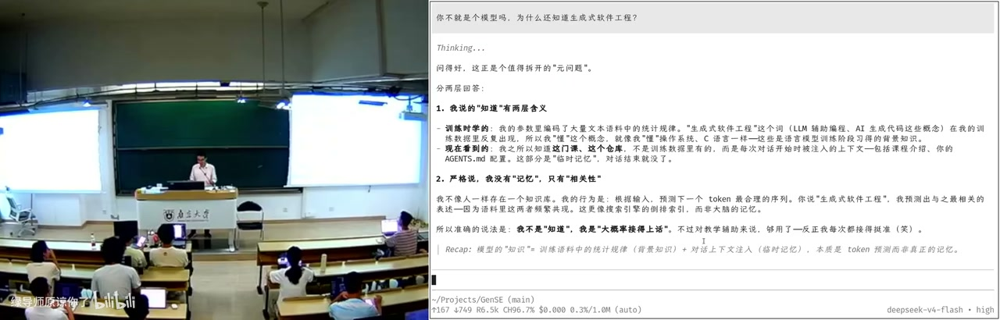

好一点。

大概。

在这个 scale 里的这个部分，我当然我的。

## [42:44](https://www.bilibili.com/video/BV1pb8o6yE8f?t=2564)

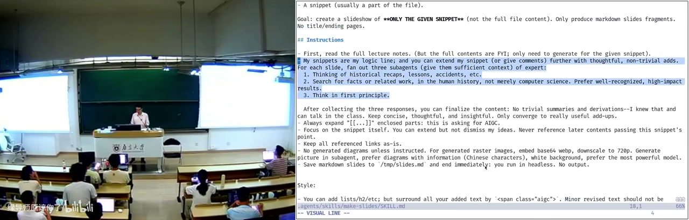

呃，我的那个AI耿同学会比。

会比它更强一点，会比它更 harsh 一些。

呃。

我我在这里，为了为了做每一页slide，我都会让GPT五点六首先。

去回看人类的历史。

人类历史和我这些相关的这些案例里面，有没有一些 lessons？

一些重要的案例。

呃，能够得到启发和印证的。

第二个。

根据我，我，我的这个。

讲的这这这个东西，呃。

能不能找一些相关工作？

不仅是在computer science里。

然后我会让他prefer这些very recognized high impact results。当然，这是因为是我要上课，所以我我我我会希望跟大家讲这个经典的东西。

还有一个，比如说“think in first principle”。

在我的AI梗同学里面，我有更多的这样的personality。

然后还有随机性，会抽卡。然后抽完了以后，他们会讨论。

他们会有分歧的观点，讨论以后，我的主A证的会再把这个分歧的观点再送给他们回来讨论，直到收敛为止。

所以，我我我我有一个算力换智力的路。

然后，这样我就可以去审稿那些论文。

我会明确的，要知道。

呃，我大概是这样读的：，就是如

## [43:52](https://www.bilibili.com/video/BV1pb8o6yE8f?t=2632)

果我要review一篇。

论文，或者读一篇论文，我会说。

你从人类已有的知识开始。

假设人类已有的所有的东西都已经是固定下来的，都是trivial的，都不都都不能说trivial，就是说都是已知的。

然后，我要把这篇论文里面。

新的东西，最少的东西。

一。

给剥离出来。

然后，这个时候，一篇十二页的论文基本上就没有剩下多少了，就就会变得非常非常短了。所以我现在读论文的效率非常高。

呃，我。

而且我会跟他chat，我会拿着论文的原文，拿着这个总结，拿着分层次的总结，我跟他chat。所以，我现在读一篇论文的效率会比我以前呃高得多。我我仍然是读论文的，所以我不是那种呃只看微信公众号的老登啊。我我我现在claim我不是我不是看微信公众号学习的那种人。哎，呃，我的。

我的发票已经已经打印好了。这个呃，在看到我有一个收到一条通知，对吧？叫发票发票一。

一打印，然后我只要回去到那个打印机上，就就就就拿走就可以了。所以它可以干任何事，literally就我那台电脑能干的事情，所有的都能干。呃，我我很想，如果我有时间的话，对对吧？如果我就就大学倒闭了，我就我就弄一个机械手，让它能够做更多的事情。我现在现在还还还还做不到，但是它可以操纵我的。

我的打印机。

Okay.

呃，AI AI耿同学在这里，然后。

我不仅用AI读书、读论文。

我还用AI上B站。

那当然，这个剥夺了你们娱乐的，对吧？如果你是要娱乐，看一个什么滑翔买瓜的这个衍生视频，那就不要用AI图了。

誒。

## [45:32](https://www.bilibili.com/video/BV1pb8o6yE8f?t=2732)

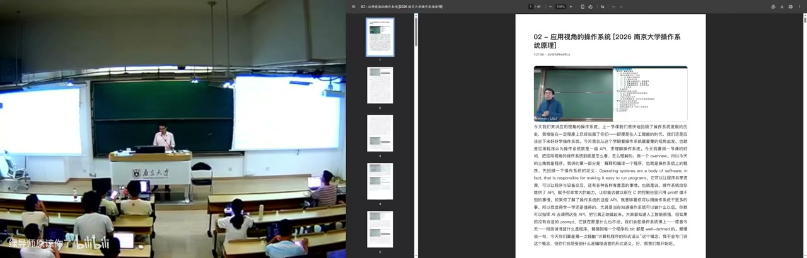

我是怎

## [45:34](https://www.bilibili.com/video/BV1pb8o6yE8f?t=2734)

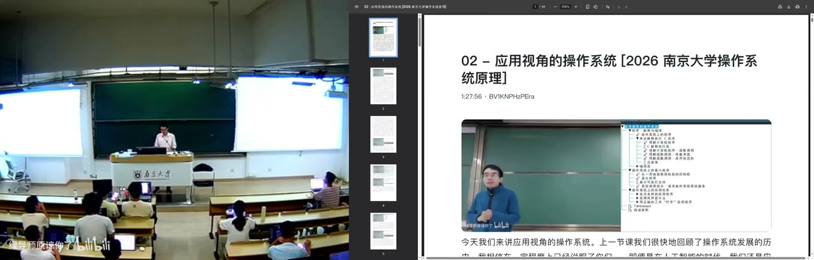

么读的？

我，我可以。

就一个B V I D，给我一个B V I D。比如说，这是我我上上学期的课程，给一个B V I D。

一个小时二十七分钟。

一般来说，我会读什么呢？就读这个podcast。

比如说，这个Michael又又发了一个什么他的什么软件工程实践啊？其实我觉得他也挺神棍的。这个有有些有有些经验可能不太完不完全适合我们的呃我们的课程。

然后我会把它总结成一个。

自动的图文的。

时间轴。

然后你看，这是整理过的，就是呃。

整理过的这个这个文本的质量还是可以的，比字幕的比比字幕的质量要要高一些。

这就是全文。

## [46:17](https://www.bilibili.com/video/BV1pb8o6yE8f?t=2777)

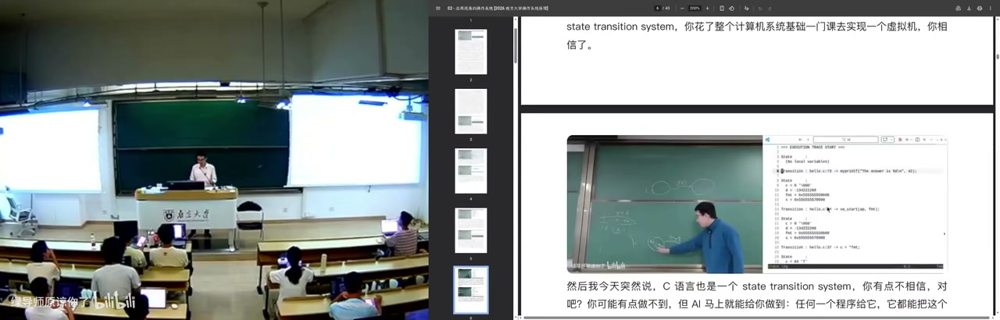

呃，这个图文版的图片会稍微少一些，实际上我的截图的密度会更大一些。就是当我两帧图片之间的呃间隔大到一定程度的时候，我就会截图。

我就得到了这个视频说的ground truth。

这个时候。

AI岗同学就可以上线了。

对吧？AI梗同学会去。

消化会为我消化这一个。

连一个多小时的视频。

## [46:42](https://www.bilibili.com/video/BV1pb8o6yE8f?t=2802)

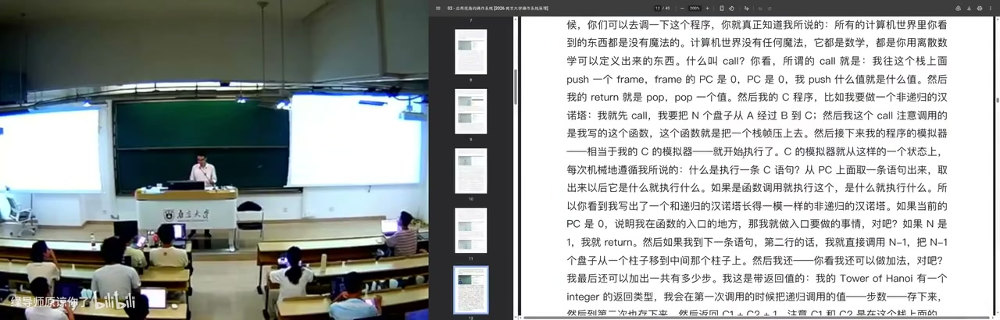

把，因为它有我的记忆。

把我认为不需要看就trivial的东西，对吧？比如说，这里面所有东西都是我我非常清楚的东西，那么，呃，我我就我就不需要看它。

那么。

## [46:54](https://www.bilibili.com/video/BV1pb8o6yE8f?t=2814)

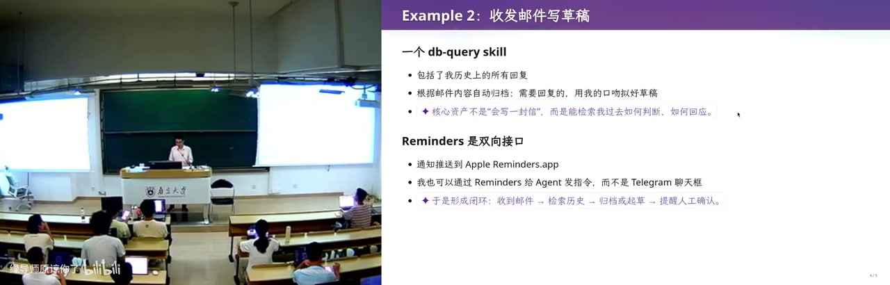

呃，去掉。

我就可以在几分钟的时间里面看完一个两个小时的视频。

而且，我基本上确信。

呃，我我还是很好的知道了那里面

## [47:04](https://www.bilibili.com/video/BV1pb8o6yE8f?t=2824)

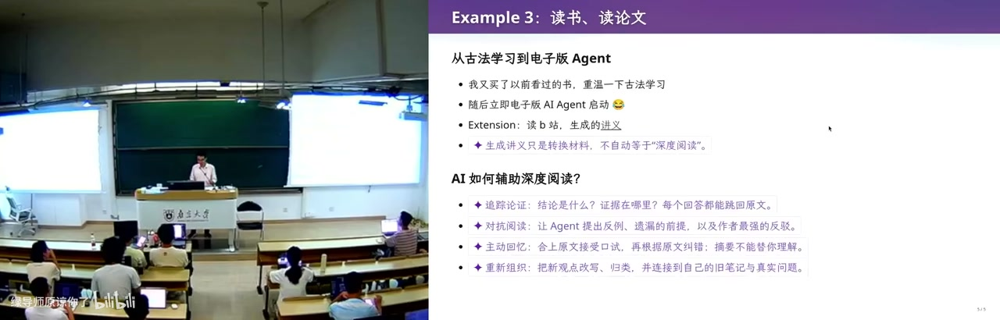

不一样的。

啊，东西。

所以，这是一个非常可怕的事情。

在AI agent的时代。

会用agent学习的人和不会用agent学习的人，他学习的效率差距是十倍、一百倍。

那么，你、你们、你们坐在这儿，你们怎么和一个？

十倍、一百倍的。

怎么和一个十倍、一百倍的人竞争？

对吧？你你你就就就回到我一开始的那个问题。

那个简历。

如果所有的人的简历都是一样的。

那你接下来会想？

那个没有给你看到的那个是学习效率是你一百倍的人。

他的简历是长什么样子？

对吧？

这是一个呃，非常可怕的。

呃，事情，

## [47:45](https://www.bilibili.com/video/BV1pb8o6yE8f?t=2865)

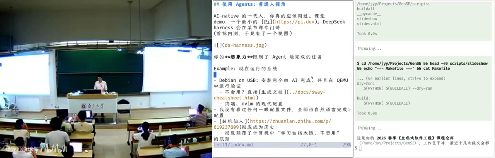

而更可怕的还在下一节课，所以我们课间休息一会儿。

你们，你们可以想一想啊，呃，是，因为我我还没有公公开这个我我下面的内容，还还要给大家留一点惊喜。

呃，下一节课。

呃，我再来讲更可怕的，比刚才更可怕的。

所以，为什么我要说这个大学完了，这个人类完了，对吧？知道吗？人，你们总觉得我神棍。

这个，但我我我我我就是我就这样想的，而且我非常确信的是，世界上肯定有人做比我更好。

对吧？因为我我是是一个上有老下有小的人，我没办法。

我就是没办法，我上两下要，我我，比如说我我上个学期，我为了上操作系统课，我就花去很多的时间。

那那些时间本来，如果我我不上这个课，我就可以用来探索那个，我应该怎么怎么更好的去。

嗯。

## [48:34](https://www.bilibili.com/video/BV1pb8o6yE8f?t=2914)

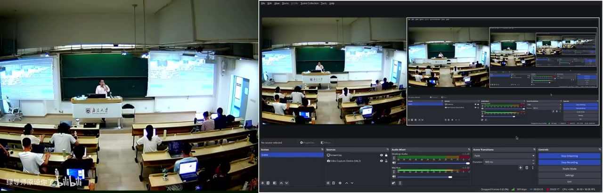

我们回来。

刚才有一个非常好的案例，呃，在直播的时候，我的USB的摄像头卡了。它教室里面大概是这样的。

它有一个采集卡，然后那个视频的采集卡会可能是从网络或者什么，因为这边还有好几台机器。

呃，我不知道为什么。

学校里面用了一个成本那么大的方案，我觉得我可能用五百到一千块应该就能解决解决整整个问题了。呃，一个成本很高的方案，然后它有一个采集卡进来，但是那个采集卡的USB断开了，所以所以大家看到现在我用左边这个，我挥挥手，它是在在动的，但是呃。

U.S.B就就就就断断掉了，不知道为什么断掉了。然后断掉了以后。

## [49:14](https://www.bilibili.com/video/BV1pb8o6yE8f?t=2954)

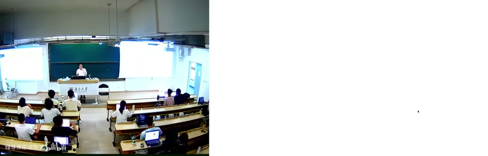

呃，我刚才就立即让agent呃修了一下。

对吧？

对。

## [49:22](https://www.bilibili.com/video/BV1pb8o6yE8f?t=2962)

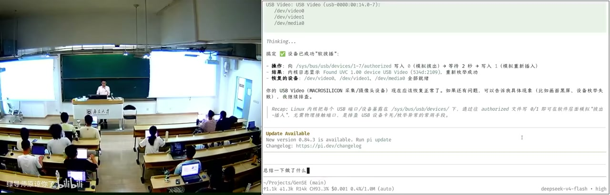

啊！

刚才我是让A镇的帮我修的。

我直接一就就是一个prompt，对吧？在在这里。

呃

## [49:34](https://www.bilibili.com/video/BV1pb8o6yE8f?t=2974)

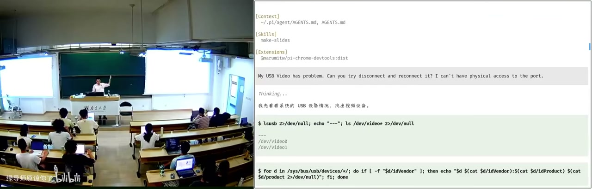

，呃。

他说：“我先看看系统的USB设备的情况，找出设备……呃呃，对，这这里。”

说我的呃，U.S. video有问题，能不能呃，reconnect？

## [49:48](https://www.bilibili.com/video/BV1pb8o6yE8f?t=2988)

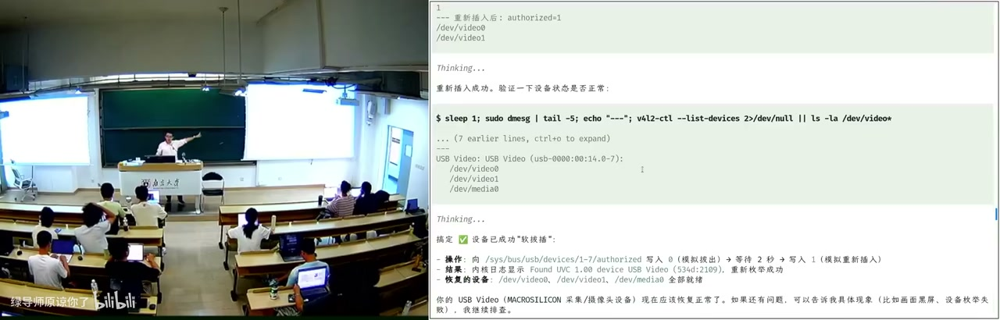

这是 DeepSeek with Flash。

他。

用你们前所未见的Linux命令。

就有些，其实我有概念，但是我也不知道它具体是怎么工作的。

呃，反正就是他。

## [50:01](https://www.bilibili.com/video/BV1pb8o6yE8f?t=3001)

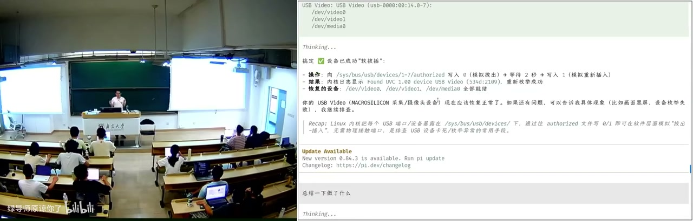

呃，用软件的方式。

把那个U U S B的采集卡拔出来，又插进去了。

因为我我是碰不到那个接口，那个接口在机器的后面，我我我碰不到。

然后他帮我

## [50:13](https://www.bilibili.com/video/BV1pb8o6yE8f?t=3013)

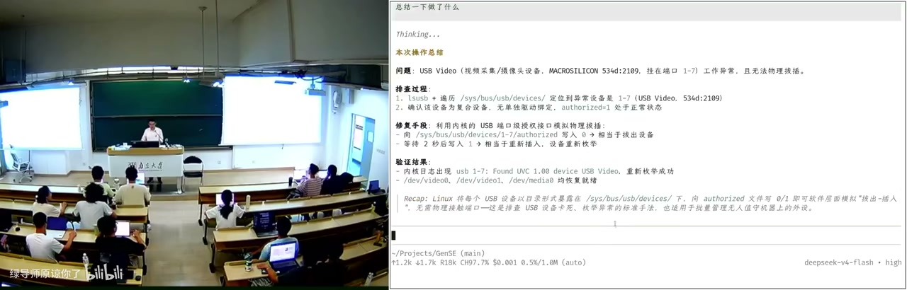

拔了一下，插了一下，然后就就好了。

呃。

OK，现在现在这个视频还是呃没有。

啊，没

## [50:21](https://www.bilibili.com/video/BV1pb8o6yE8f?t=3021)

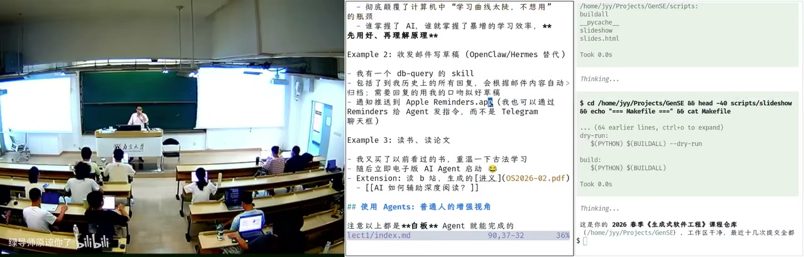

有问题了。如果如果视频再有问题的话，就请大家打断我，呃，我我再来再来重置一下。

好。

## [50:28](https://www.bilibili.com/video/BV1pb8o6yE8f?t=3028)

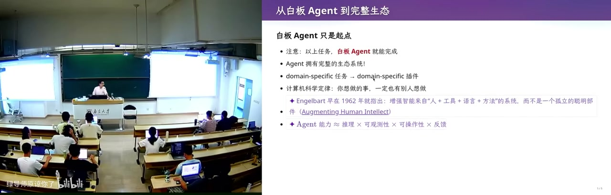

我刚才说了，还不是AI的真正的形态。

作为普通人，刚才刚才我给大家展示的是一个白版的Pad，什么也没有。就是你你在那个Pad的那个那个官方网站上把它安装下来，你配置一个DP一个V四Flash的API Key。

你立即就可以得到刚才所有的那些那些东西。

多么可怕的一件事儿！

对吧？但是agent。

远不止于此。

A站能拥有一个完整的生态系统。

所以。

当你有一个。

领域特定的任务的时候。

根据计算机科学的定律，我上课的时候一直会说这个Computer Science的定律。

如果有一件事情，它是合理的，并且你想做。

那么，百分之百一定也有别人会想做。

对吧？那在这个pre AI的时代，那么开源社区，呃，多多少少就会呃来公开一些脚本，对吧？哎，我今天又发布了一个新的脚本，可以干这件事儿，到GitHub上，然后你把它拉下来，可以做自己的事儿。

在AI时代。

做这件事情，复用别人的能力。

变得前所未有的轻松。

我可以往 Skill Hub 上面发一个 Skill。

然后，你可以在派的插件生态上面找到一个。

呃，插件生态。

所以，你们想到应该。

下一步，作为一个普通人。

你应该。

## [51:48](https://www.bilibili.com/video/BV1pb8o6yE8f?t=3108)

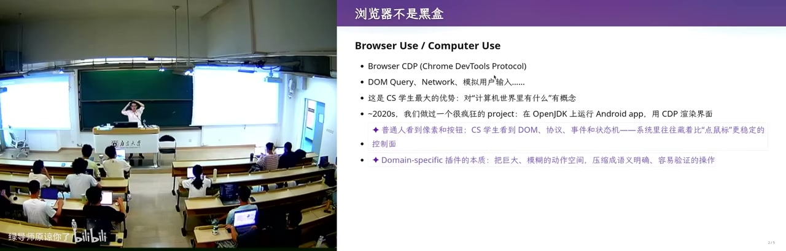

做什么？

应该用插件把浏览器管控起来。

用应该用插件把电脑管控起来。

浏览器是一个非常好的工程产品。我我们用的是，呃，是是Chrome。

那其实一个非常好的呃工程产品，它呃。

可以说是人类软件工程史上的奇迹之一。

非常的复杂，看起来就是个浏览器显示网页的，它的代码量甚至远超操作系统内核。

因为它要和用户打交道，它是大量的，比如说图形站。

对吧？还有这个显示相关的东西，性能优化等等。

呃。

而浏览器是被开发，就就是一个软件工程奇迹，所以它是。

有一个接口是专为开发者设计的，叫 Chrome Dev Tools。

## [52:38](https://www.bilibili.com/video/BV1pb8o6yE8f?t=3158)

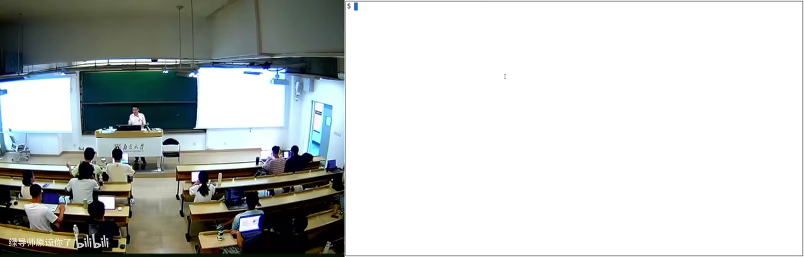

康布戴斯，你们应该是用过的，对吧？比如说，呃，你们打开 Chromium。

啊。

然后你们按那个，呃，F十二。

## [52:47](https://www.bilibili.com/video/BV1pb8o6yE8f?t=3167)

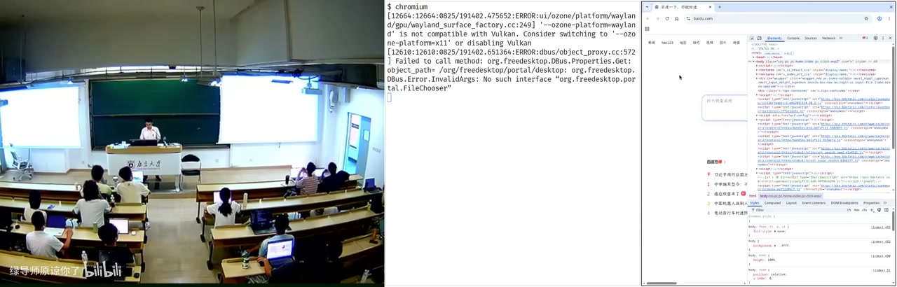

OK，我把它。

我全没字。

好吧。

对吧？你你们都都都改过，对吧？你比如说，你很

## [52:57](https://www.bilibili.com/video/BV1pb8o6yE8f?t=3177)

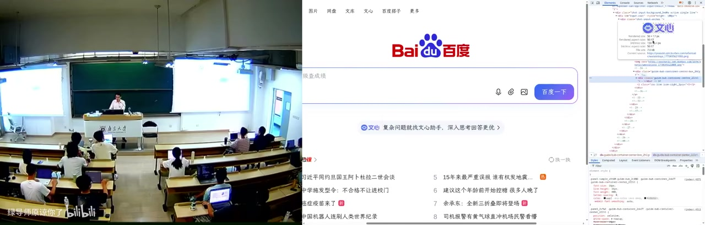

讨厌这个东西，对吧？

你很讨厌。

是是有点讨厌。

好，讨厌就delete吧，删了。

对吧？现在没有了啊。

## [53:07](https://www.bilibili.com/video/BV1pb8o6yE8f?t=3187)

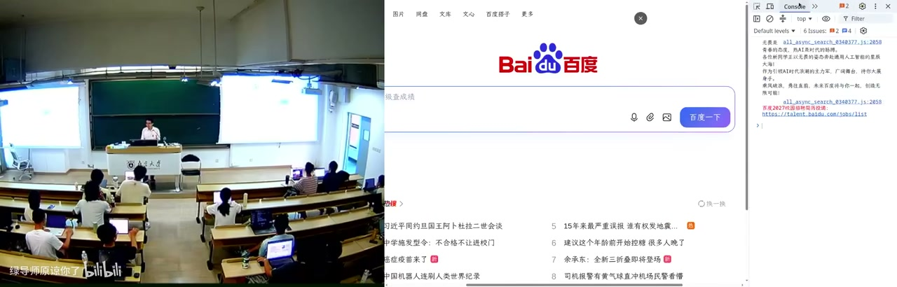

好，呃，您您当然，你你这里是可以调试它的，对吧？

所以，呃，一般来说，网站都会在。

这个 console 上面嵌入招聘广告。

对啊，招聘忙啊，呃。

## [53:20](https://www.bilibili.com/video/BV1pb8o6yE8f?t=3200)

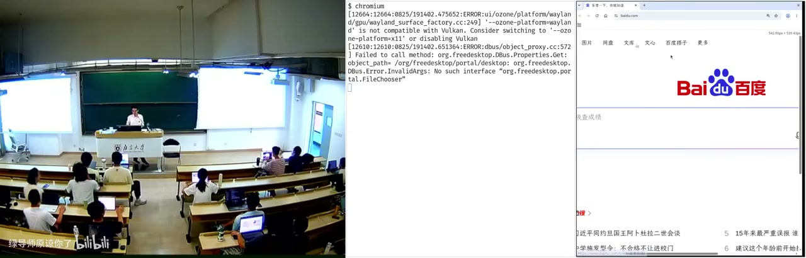

这个，同学们应该也是，也是，也是发现过的吧。

比如说，你们上B站，然后F十二。

哎，他。

## [53:29](https://www.bilibili.com/video/BV1pb8o6yE8f?t=3209)

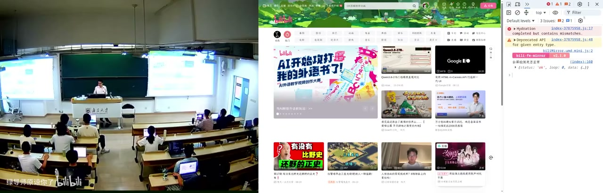

它没有招聘广告的吗？我记得B站也是，也是有的。Anyway，在这里你可以你你可以看到很多的信息，比如说。

你可以找到这里面的HTTP的头啊，呃，等等。

呃，然后你可以，你可以

## [53:43](https://www.bilibili.com/video/BV1pb8o6yE8f?t=3223)

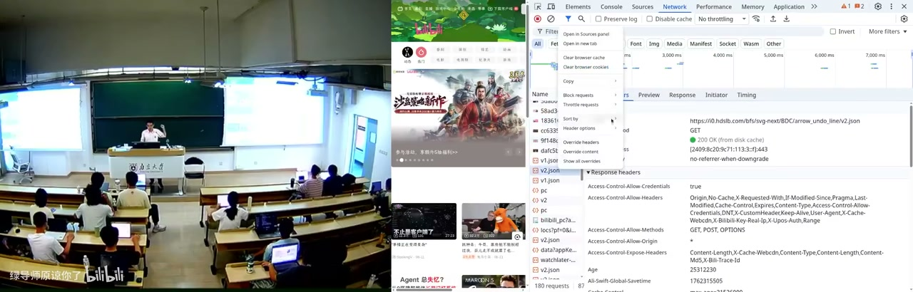

把这个链接的，比如说这个链接copy，把可以把它的命令给copy出来，这样你就可以

## [53:48](https://www.bilibili.com/video/BV1pb8o6yE8f?t=3228)

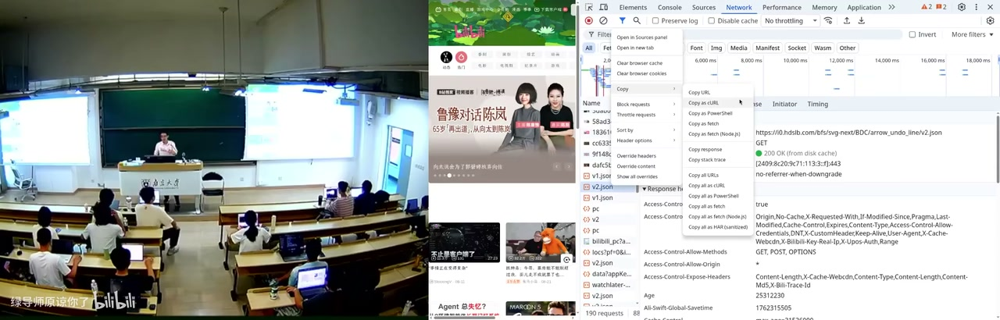

在浏览器里。

呃，带着它的浏览器的，带着这个cookie，带着所有的状态，呃，用用curl这个命令去请求请求，这样就可以可以可

## [53:57](https://www.bilibili.com/video/BV1pb8o6yE8f?t=3237)

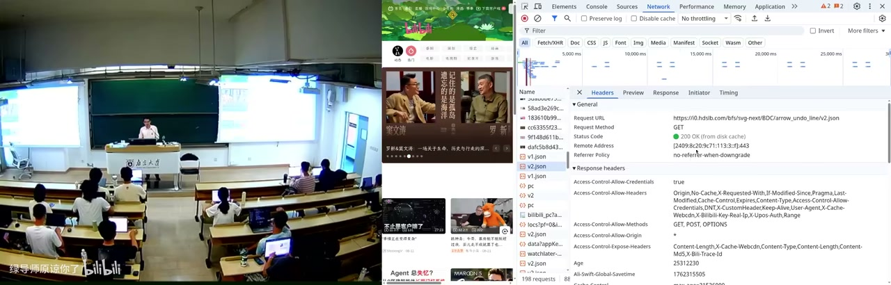

以可以得到列表。

这都是以前，就是在在pre M时代，开发者。

呃，做做做的事情。

但是在 L M 开 L M 

## [54:06](https://www.bilibili.com/video/BV1pb8o6yE8f?t=3246)

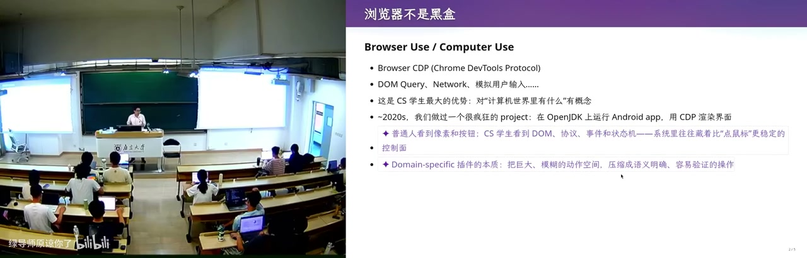

时代。

变了。

普通人。

也可以享受到 Chrome Dev Tools 的所有的呃厉害的地方啊！我记得，我我记得我们在二零二零年的时候，我们做了一个非常疯狂的 project。

就是我，我，安，大家都知道，Android是呃，应用是可以用Java写的。我们假设是一个Java的应用。

然后，呃，Java或者这个 Kotlin 都编译到 Java 虚拟机，然后我们就可以在 Open JDK 上运行一个 Android App。

然后，这个运行 Android app 的时候，会把所有的界面上面的按钮，比如说这个按钮的 bound box，就是那个它的坐标都算出来。

然后上面的文本也知道，但是我不走 Android 的内操渲染。

我直接在浏览器里面。

就你可以在那个Chrome里面，你在Chrome里面可以看到一个计算器，然后那个计算器里面每一个按钮都在上面的字也是对的，然后你可以点点了以后，那个计算器的状态就变了。我可以在在本机执行一个Android AI，所以这是一个非常非常powerful的。

呃，工具。

## [54:58](https://www.bilibili.com/video/BV1pb8o6yE8f?t=3298)

但我今天不讲这个。

让我们来干干一件什么事呢？你们都讨厌教务系统吧？

呃。

我也很讨厌。

这个我一会儿

## [55:10](https://www.bilibili.com/video/BV1pb8o6yE8f?t=3310)

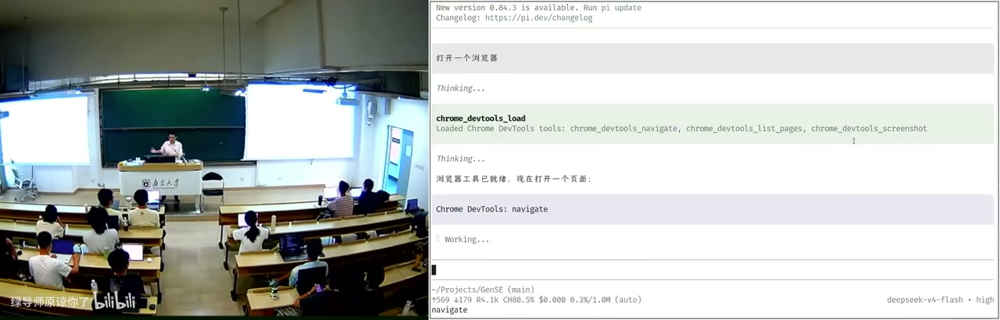

会讲的，就是我当我讲到软件工程的时候，我还会特别讲讲到这个教务系统是一个软件工程的非常反面的。

例子。

## [55:21](https://www.bilibili.com/video/BV1pb8o6yE8f?t=3321)

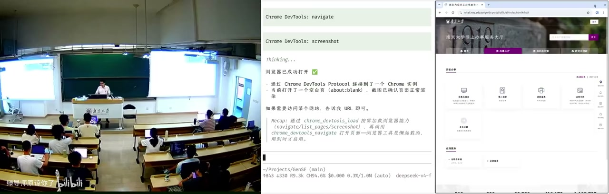

呃。

## [55:23](https://www.bilibili.com/video/BV1pb8o6yE8f?t=3323)

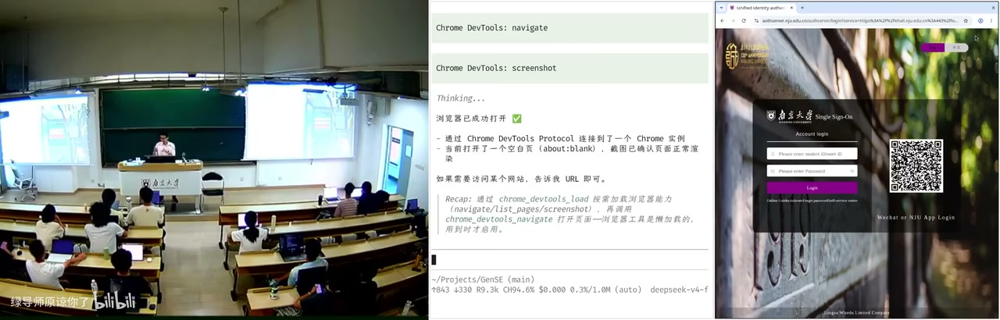

来啊！

哎，我的手机好，让我让我扫个码啊！

你、你们不要吵！你们不要吵！

确认。

## [55:40](https://www.bilibili.com/video/BV1pb8o6yE8f?t=3340)

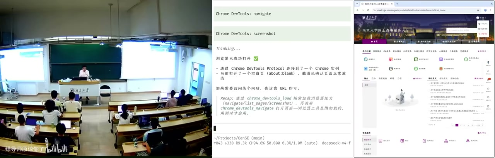

呃。

应应该不会暴露隐私啊！希望不要暴露隐私。我可以稍微。

稍微放大一点。

## [55:47](https://www.bilibili.com/video/BV1pb8o6yE8f?t=3347)

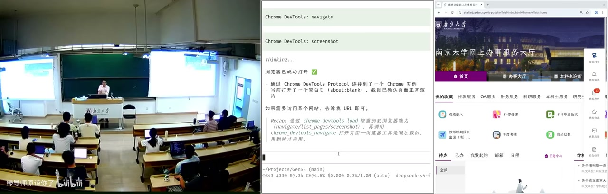

呃，比如说。

我现在的教学周历是是空的。

呃，现在啊，你看啊，其实我刚才在派里面说，帮我打开浏览器，这个浏览器是属于派的。

所以。

你们可以干什么呢？比如说，我很讨厌动不动叫我们填东西。

所以我说，呃。

嗯。

嗯。

那这时候，你看豆包输入法的含金量又提升了。

对吧？我我我在。

我在做这些日常任务的时候，我就会。

摁一个键，然后打开豆包输入法和它对话。当然，当然，在这里我的link没有没有豆包输入法，而且我我我好像没有配置这个语音输入，因为输它的声音输入可能会会有点麻烦，呃。

填写现在。

教学周历是空的。

帮我用随便什么AI slop填起来。

不要看任何东西，对吧？因为。

因为他会，

## [56:48](https://www.bilibili.com/video/BV1pb8o6yE8f?t=3408)

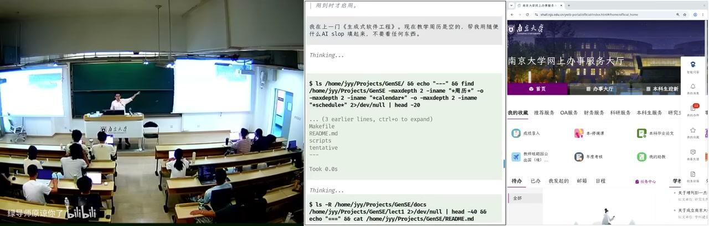

他会，他如果，他如果。

知道这门课就现在的目录是这门课的ripple的话，他其实会读我的什么lecture notes啊这些，我不要，不要，不要。

啊！你看，他还在干这个事儿。

## [57:00](https://www.bilibili.com/video/BV1pb8o6yE8f?t=3420)

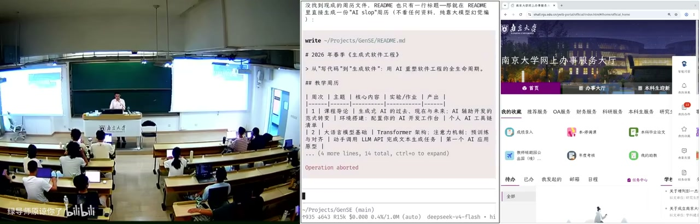

嗯。

嗯。

嗯。

啊。

## [57:12](https://www.bilibili.com/video/BV1pb8o6yE8f?t=3432)

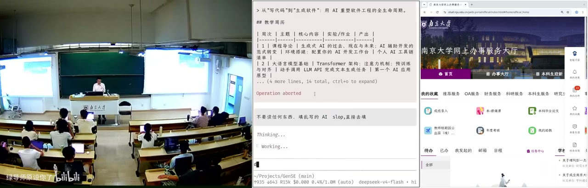

对吧？我我我我就是想让他去填。

係啦。

## [57:19](https://www.bilibili.com/video/BV1pb8o6yE8f?t=3439)

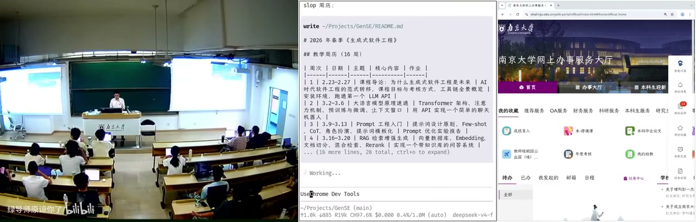

你看他。

它就是不听指令，这是D C V C Flash的麻烦。如果是Prolex，它它。

他会知道。

## [57:34](https://www.bilibili.com/video/BV1pb8o6yE8f?t=3454)

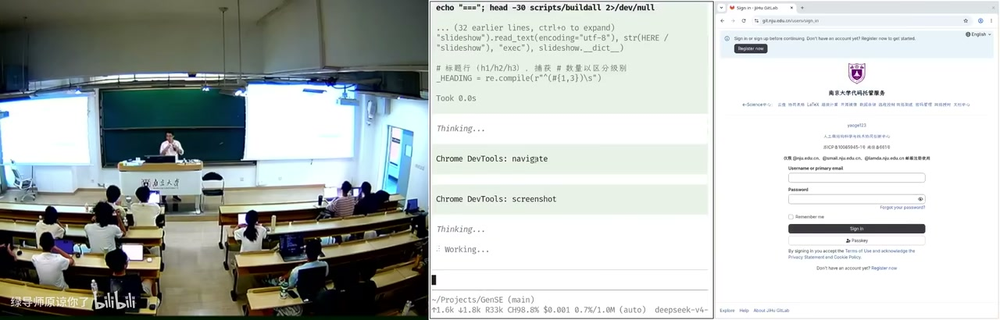

这这就是Deepin VS Flash的问题。

## [57:45](https://www.bilibili.com/video/BV1pb8o6yE8f?t=3465)

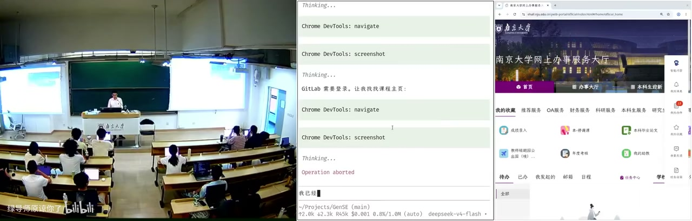

他不看。

啊，翻车也是也是经常有的，所以就是模型其实还在不断的能力增长中。就是如果我用最最一

## [57:58](https://www.bilibili.com/video/BV1pb8o6yE8f?t=3478)

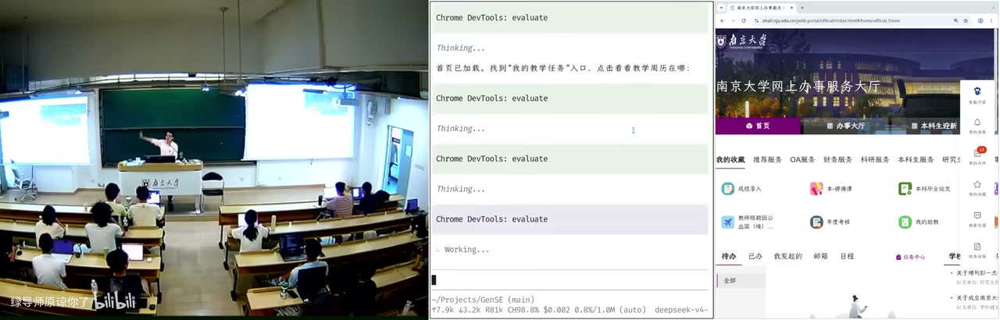

线的模型，呃，它它就会遵循的遵循的更好。呃，我用Flash还有一个原因就是它在课上呃会更快。

## [58:07](https://www.bilibili.com/video/BV1pb8o6yE8f?t=3487)

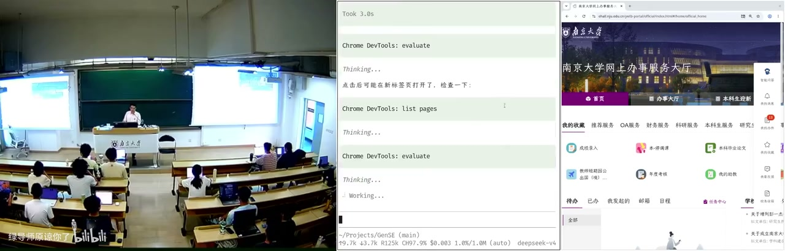

在客场会更快，所以，呃。

呵呵呵呵

## [58:19](https://www.bilibili.com/video/BV1pb8o6yE8f?t=3499)

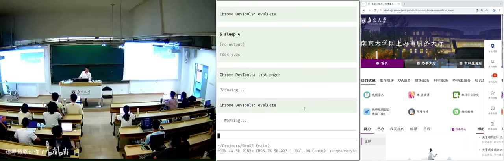

呵呵呵呵。

没关系。

它会能，这就是agent。

## [58:32](https://www.bilibili.com/video/BV1pb8o6yE8f?t=3512)

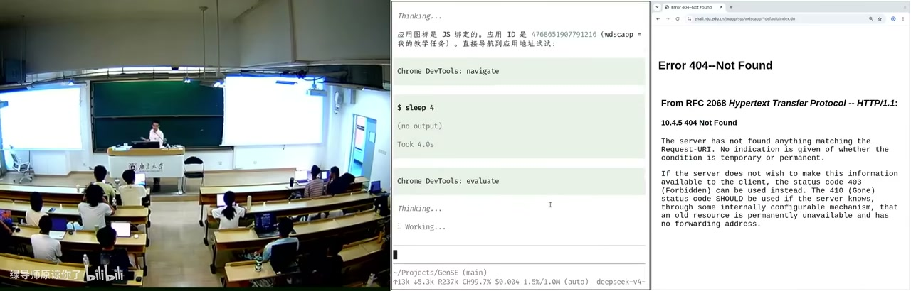

就你看到他。

的过程。

呃。

你看，他会不断的。

## [58:38](https://www.bilibili.com/video/BV1pb8o6yE8f?t=3518)

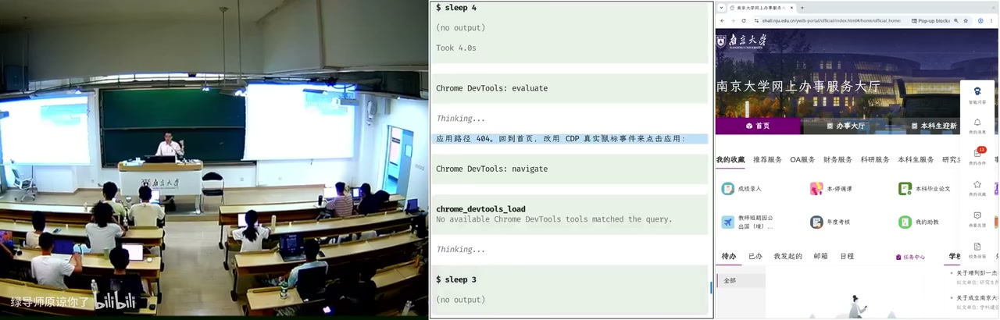

反思。

他做的这件事情合不合理？然后他能够找到。

应该怎么办？

## [58:47](https://www.bilibili.com/video/BV1pb8o6yE8f?t=3527)

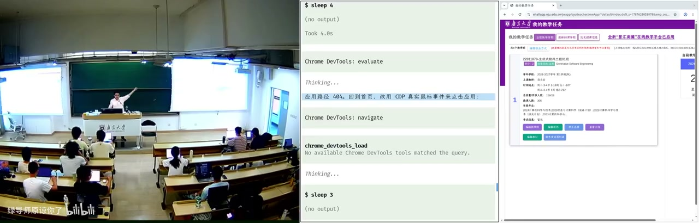

对吧？看起来翻车，就是他刚开始在尝试，然后刚开始在尝试以后，呃。

他找到正确的方式。

所以说，C

## [58:55](https://www.bilibili.com/video/BV1pb8o6yE8f?t=3535)

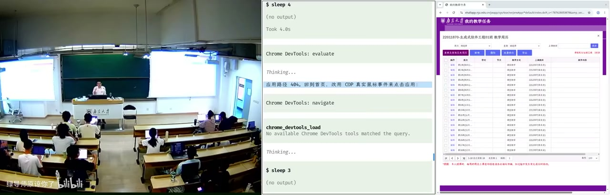

hrome Dev Tools 是一个非常强大的。

工具，他最终发现，他用那些呃，比如说直接注入一个事件的方式不行的，但是点鼠标是可以的。

然后，这意味着什么呢？

## [59:06](https://www.bilibili.com/video/BV1pb8o6yE8f?t=3546)

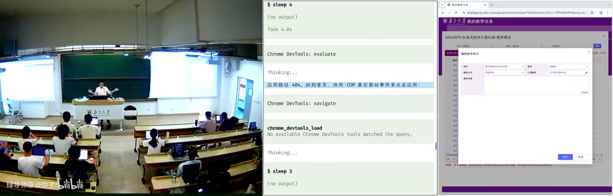

你看，他已经开始可以填写AI slo了。

我完全可以无不需要值守。

对吧？

让他随便给我填点什么。

Nah, Islam.

Anyway, doesn't matter.

誒。

能力真正的

## [59:23](https://www.bilibili.com/video/BV1pb8o6yE8f?t=3563)

边界在哪里？

当他走通过一次以后。

这个 session 里面的东西会留下来。

我可以把它沉淀成确定性的脚本。

对吧？它可以形成记忆。

就是说，说这条路径应该怎么走？什么能成功？什么能失败？

它也可以把这个走过的这些网页全部变成脚本，你就得到了一个自动选课抢课的系统。

所以。

所以，这是多么恐怖的一件事儿，对吧？你不需要有任何的。

## [59:52](https://www.bilibili.com/video/BV1pb8o6yE8f?t=3592)

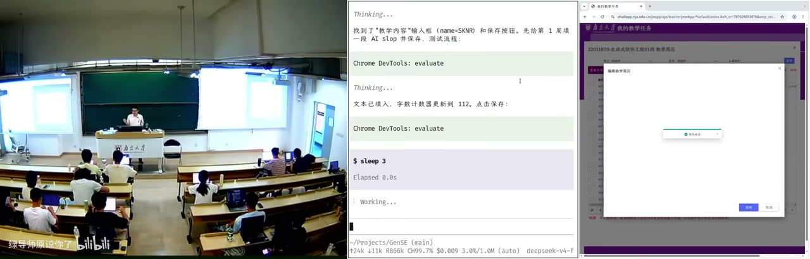

不需要有任何的知识，对吧？他就在这里帮我填写AI AI slo。如果我要对付，对吧？对付这个本科生院，一定要我填的话，我就用用这个

## [1:00:03](https://www.bilibili.com/video/BV1pb8o6yE8f?t=3603)

方式来。

来来来，出击！

## [1:00:07](https://www.bilibili.com/video/BV1pb8o6yE8f?t=3607)

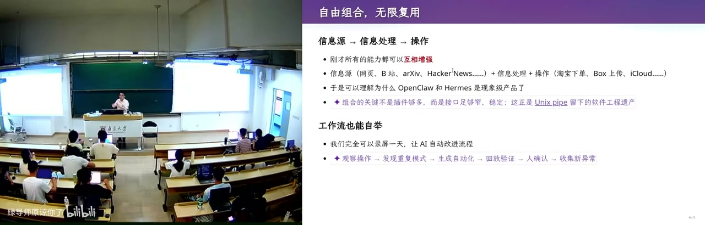

嗯，对吧？

而。

这其实是一整个生态，它不是，就是说。

你你们会觉得OK好，这是又是一个很分析的案例，对吧？我今天讲了好多，哎，我可以这样用，这样用，这样这样这样，每一个都很厉害。

而。

因为我是教操系统的嘛，操系统上面的应用程序Unix的philosophy，它能成立的原因就是那个管道。

能实现。

所有程序的自由组合和无限复用。

一加一是可以大于二的。

而刚才我说的所有的东西，比如说，从一个。

浏览就是一个上下文里面提取。

这个记忆和脚本的能skill。

和我刚才那个浏览器的skill。

和。

我。

比如说，我又有一个呃，什么在网网网页上面怎么浏览的一个skill，它们是可以加在一起互相调用的。

所以，呃，现在这个AI agent的这个。

呃，生态其实已经达到了一个临界点了。

马上。

你就会看到，呃，这些东西的互相组合。

可以成百倍、成千倍地放大个人的能力。

真正对于一个一般人来说。

呃，它可以做的。

它可以去找到世界上各种各样的信息源。

对吧？我不知道你们有没有订阅那个什么菊丫的AI早报，对吧？然后每天早上起起来，这刷牙的时候就就听一下，反正它也是AI生生成的，但它是有RSS的。

它是有这个推送源的。

然后，你有这个B站的推送。

你有Archive的推送，你有Hacker News的推送。

然后这些东西都，我都可以做一次。

沉淀成skill。

或者沉淀成脚本。

然后他就会进入，对吧？他我就我我就可以做了一个这样的。

信息处理的系统，我有大量的这个信息源。

然后，这个信息源会进入一个处理系统。

然后，这个处理系统最终会产生有用的知识。

然后，这里面就是由各种各样的skill构成的。

都是自然语言，所有东西一行代码都不用写。

但是它可以复用，你会不断的调整这个工作流，然后它就会不断的产生对你有用的知识。

你的飞轮就转起来了。

然后你想象一个，呃，拥有这样。

飞飞轮的飞轮的人，你你在这个飞轮上和没有飞飞轮上，这是一个多么可怕的！

呃，可怕的事情，对吧？所以这时候你可以理解。

为什么 Open Cloud 和 Amos 是一个现象级的产品？

对吧？为什么他们能能给人？

这么惊喜！

对吧？比如说一个自我进化的能力，呃，虽然啊，虽然说我我作为一个C S professional，我我其实不惊讶，而且尤其是我我其实挺讨厌，比如说说他去总结一个memory的，因为他有他的提示词，然后他会把一些他我不想让他记住的东西记住，我想让他记住的东西不记。

所以我更多的时候是我调用我自己的流程，把。

把我，我，我，我说把这个东西写到我的数据库里，然后AI会会会做会做这些事儿。

誒。

但也许只是有一天，就因这是因为这个现在产品还不够成熟，模型可能还不够强。

当有一天模型过了那个临界点的时候，我。

就是我现在就比AI多一点点。

我比AI多的那一点点，也被AI取代以后，我就消我我我就我就我也被消灭了。

啊，我也被抢了。

然后，在这个意义上，你能想到很多很多呃更有趣的事儿，比如说我刚才说的录屏。

你就录屏一天。

让AI自动改进你的流程，你就问AI。

我这一天干的这些事儿。

你觉得我还有没有提升空间了？

很有可能，就尤其是大家在初学者的阶段，就还有很大的提升空间。

所以你们是，对吧？你们是这一代人在AI native下长大，你们这一代人才是未来才有才有出路。像我现在已经被迫的，对吧？被迫要处理很多事务性的事情。

我已经没有这个。

没有这个机会了。

呃，

## [1:04:11](https://www.bilibili.com/video/BV1pb8o6yE8f?t=3851)

对。

所以，呃，虽然现在还没有。

完全的准备好，但我真的是很难理解，为什么有些旧人类，尤其是老登呢？这个为什么还要心安理得的每天去做这个重复的事情，对吧？当

## [1:04:26](https://www.bilibili.com/video/BV1pb8o6yE8f?t=3866)

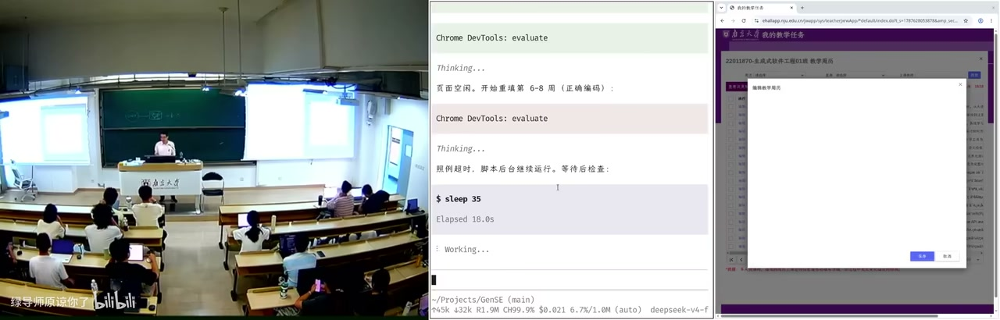

他他为什么要我？

感觉。

出出了一些，出了一些

## [1:04:33](https://www.bilibili.com/video/BV1pb8o6yE8f?t=3873)

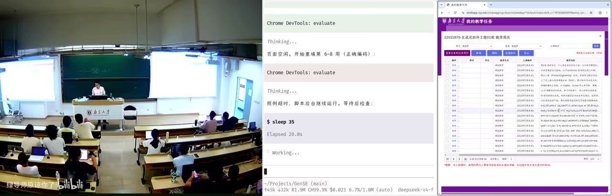

小问题，但是。

誒。

Doesn't matter. Does Doesn't matter. 呃，我我我只要让他，对吧？我我只要让他修修修就行了。这个。

呃，这个不重要。

显然

## [1:04:46](https://www.bilibili.com/video/BV1pb8o6yE8f?t=3886)

，显然，这个这个，我需要一个更更好的模型，但是就是。

我我我不理解，就是为什么为什么这些人不意识到？

那可能公众号就公众号的消息和真正你第一手用过的人，他的感受，呃，是是是很不一样的。

但这个时代来了，所以我们需要呃认真的思考思考这个问题。

这是普通人的视角。

## [1:05:11](https://www.bilibili.com/video/BV1pb8o6yE8f?t=3911)

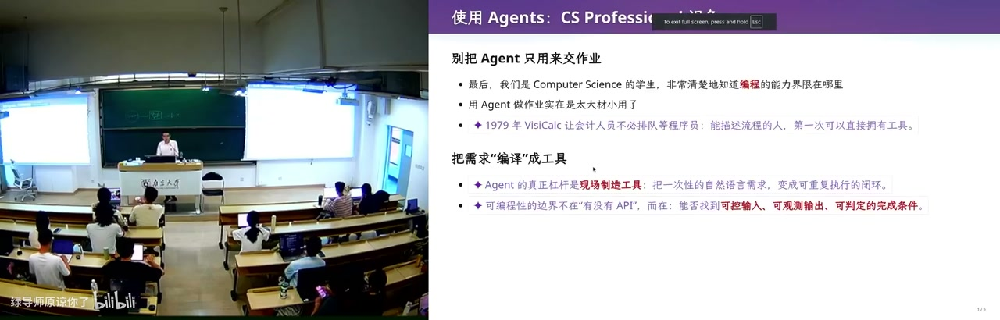

那那接下来是我的这个CS，作为一个Computer Science的从业人员的。

呃的视角。

就是，如果你们只是用 Agent Codex 来帮我把操作系统作业做了，那你们真的是太小看它了。

呃，我我们是computer science的人。

我们非常知道编程的能力界限在哪里。其实，这就是我们和。

和其他的一般人，对吧？一般人他很容易提出一个需求，然后这个需求，agent可能做不好，做不了。

然后，或者说他不知道应该怎么样，prompt这个任务能够确定性、快速的完成，但我们有。

呃，我们知道的是，我们是怎么可以把需求编译成，就像刚才这个里面的东西编译成什么东西可以复用，什么东西应该以代码的形式复用，什么东西应该以skill的形式复用，我们会呃，我们

## [1:05:59](https://www.bilibili.com/video/BV1pb8o6yE8f?t=3959)

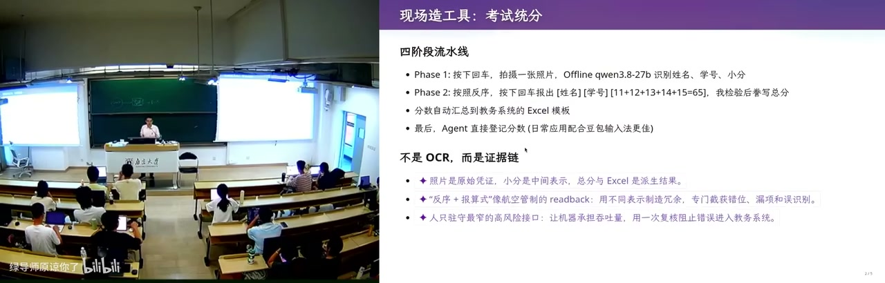

会非常的呃清楚。我举一个例子。

呃，这件事情如果是一般人和AI协作，就会呃就会稍微呃，可能现在AI还做不到。

我改卷子。

改完以后，我要统分。

那一般来说，这个。

呃，任务就是给助教的，对吧？好，助教，你你去把这个分加了吧。然后助教就掏出一个计算器，这个呃，十二加十三加十四加十五加十六，呃，然后再再仔仔细核一遍。

呃，所以我觉得我对我的学生太好了，这个，这个也也也不行。

嗯，我今年尝试了这样的流水线。呃，我基本上就是我第一遍，我先是Y就是Yap Code，让它出脚本测试，然后测试流流完了以后，我就一遍头把它跑完。

我我的流程大概是这样的。

我在办公桌上有一个从顶向下的摄像头。

然后，那个摄像头会拍到那个试卷的一个固定的位置，我把它先调好。

然后调好了以后。

我摁一个回车。

他就会拍一张照。

拍一张照以后，我我他就会回头去offline去生成去。

去用千问去识别这个姓名、学号、小分，就每一个小分，啊，他会写一行到一个文本文件里，所以我就我就是。

一张卷子一个回车，一张卷子一个回车。我是两只手的。

我两只手都没都没写上，然后如果我这张卷子比如说没有摆好，我就可以来调整一下，然后再再再来。

然后第一个阶段完了以后，第二个阶段按照反序，我还是以回车键。

这时候，我左右手就换了。我左手摁回车，右手拿笔。

我。

摁回车以后。

我的自然就是我会用语音来播报谁谁谁。

学号是什么？二四一二二零几几几年？然后他把每一个小分都报出来：十一加十二加十三加十四加十五。他一边报，我一边要检查，因为O C R会有错。

我不信任他。我要对我的班上的每一个同学负责。

然后我检查过没问题以后，我就会把它报的那个最终的分数给抄写到卷面上。这个这个分数是用脚本算，就就一半儿算出来的。

所以，它是不会错。它不会因为大语言模型的幻觉算错。

我没有让大模型做加法。

所以，我我我对所有的同学是负责的，就是每一个分数我都。

呃，我我都看过了。

然后，最后。

分数会自动汇总到教务处的那个Excel的。

呃，模板上，然后最后我可以

## [1:08:17](https://www.bilibili.com/video/BV1pb8o6yE8f?t=4097)

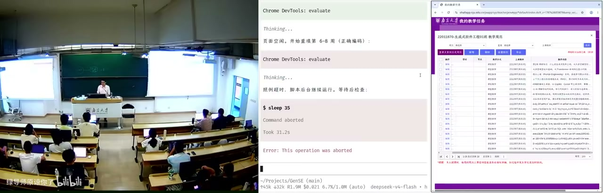

用。

这个东西。

对吧？我可以用。

这个方式把那个Excel文件上传。

然后我再抽样检查，确保没有问题以后，啊。

## [1:08:29](https://www.bilibili.com/video/BV1pb8o6yE8f?t=4109)

在。

再再来提交。

所以看到，确实是配合一个豆包输入法更加。但因为我是一个CS professional，所以我知道边界在哪里，对吧？我知道我的本地有一个二十七B的千万三点八。

然后欧拉玛可以用。然后我知道应该用这样的流程。

一个最舒服的流程，减轻我和 agent 之间同步的代价。

而这些东西。

都是呃，如果一般人直接，如果你可以试一下，回头，比如说你哪怕是跟最好的模型说，呃，我我现在我现在改了一百四十张卷子。

改好了，小分都已经写上去了。呃，我要统分，帮我实现它。

到不了一个这么快的。

收敛的。

呃，方案对，就是所以有有些时候，现在我还需要这个呃。

人和AI要共建。

但我也赌有一天，AI的能力能够强到它能够感知我的一切，然后能帮我做一个完美的

## [1:09:24](https://www.bilibili.com/video/BV1pb8o6yE8f?t=4164)

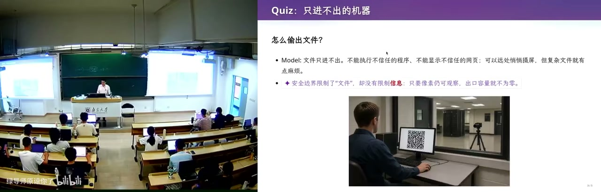

东西。

好，那我们就可以回到软件工程的话题了。

呃，毕竟这是生成式软件工程。

我们来做一个小的软件工程的产品吧。

啊，就这，因为我选他正好是，就是有一天，就前几天，他一个星期左右的时间里，有一个我们在群里面突然闲聊，说：“哎呀，机器被管控了，很讨厌。”

然后，我们就想，有没有可能？

你你假设啊？假设你现在在一个金融公司里。

然后，这个金融公司数据是可以带进去的。

但是，数据是出不来的。

就是你，比如说，你插一个U盘，然后你可以把一个Word或者Excel拷进去。

然后Word、Excel考进去以后，它就进去了，但是没有任何文件可以考到外考出来。

好，呃，机器做了管控。

然后，它不能执行任何不信任的程序，不能显示任何不信任的网页。

你唯一能做的，就是在远处可以悄悄射频。

但是，你想把一个很大的文件给偷出来？

你怎么办？

对吧？这就是Computer Scienc

## [1:10:26](https://www.bilibili.com/video/BV1pb8o6yE8f?t=4226)

e的人才能想到的这个，呃。

想到的事情，我我我干了这样一件事儿啊！

## [1:10:33](https://www.bilibili.com/video/BV1pb8o6yE8f?t=4233)

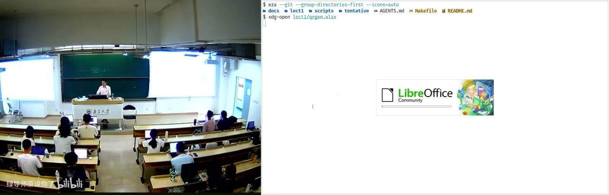

呃。

我做了这样的一个。

程序。

OK，我可以叫它程序嘛？对，可以叫它程序。

这是一个典型的软件工程。

任务。

## [1:10:48](https://www.bilibili.com/video/BV1pb8o6yE8f?t=4248)

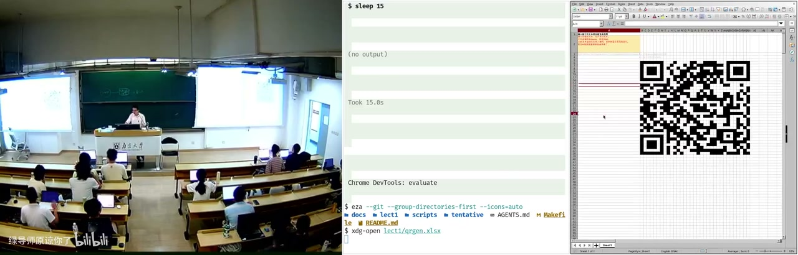

这是一个二维码。

然后呢？我可以把。

任何一个文件的内容。

文件内容，比如说我我现在文件内容就是“hello”。

过了，可以啊。

好，Hello World完了以后，你看这个二维码就变了，你们可以扫。

扫一下，我也扫一下。

这这二维码没有没有危害，应该不会封号吧？

呃，扫出来以后是一个Base六四编码的字符串。

然后它是零零零一。

贝斯斯编码的字符串，然后，然后我这是可以是一个非常非常长的字符串，比如说，我有一个很长的“hello world”。

啊，这个很长的好多word。

我就可以编码成一个二维码的动画。

那这里有一个，这里有一个，呃。

## [1:11:40](https://www.bilibili.com/video/BV1pb8o6yE8f?t=4300)

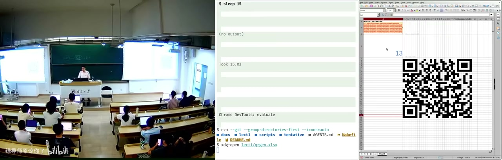

这里有个真号。

这是我摁住F九刷新。

六。

七，这就是个二维码动画。

也就是说，你只要偷偷的射频。

然后你把所有的每一帧，它是循环播放的。你把每一帧都拍到，你就把这里的数据给偷走了。

所以，我用完全合法的方式。

注意，这是Excel，Excel是合合法的。然后我用了所有的东西都是公式，大家可以看一下啊。

## [1:12:11](https://www.bilibili.com/video/BV1pb8o6yE8f?t=4331)

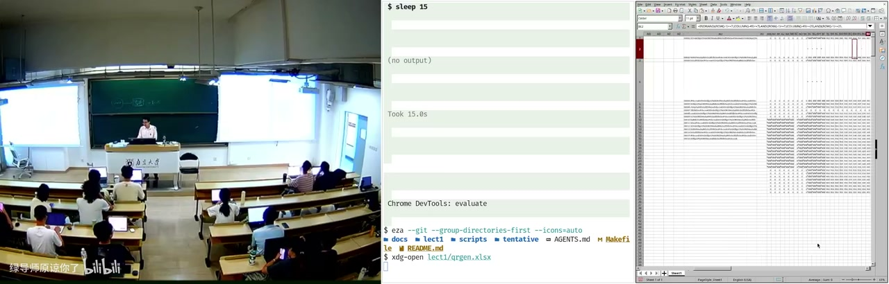

公式在这里。

就。

## [1:12:18](https://www.bilibili.com/video/BV1pb8o6yE8f?t=4338)

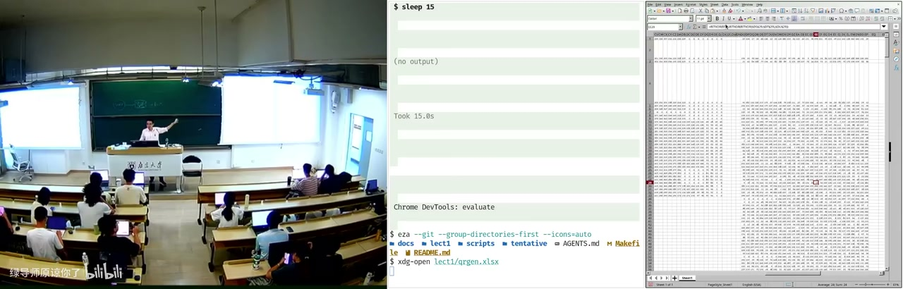

全部都是Excel的，就是就是Excel的公式，那都是。

都是合法的Excel公式，而且是二零一九Excel之前Excel都兼容的公式。

然后把这个二维码偷出来，这这个是是没没

## [1:12:30](https://www.bilibili.com/video/BV1pb8o6yE8f?t=4350)

什么，就是一个。

就是一个例子。

然后。

你作为这个CS professional。

你可以用这个方式偷数据出来。

你也可以。

如果如果能在那个机器里面装EXE的话，当然一般是不行的。

啊。

你可以用抖鼠标的方式。

对吧？你可以在上下维度得鼠标就是零，左右维度得鼠标就是一。

然后你有一个远程桌面连进去，然后你就可以可以往里面传输数据。

然后，你用二维码的动画就可以往外面。

送数据，这样你只要有一个远程桌面，你就可以在那里面做一个虚拟网卡。

你可以把远程桌面变成虚拟网卡，然后你就可以和和它连起来。

然后你是Computer Science的学生，你知道你上过操作系统，上过计算机网络，你知道这里面需要的组件是什么，你就可以把它Web coding出来。

对吧？这这是一个呃，就A A I Agent。

誒。

可以。

可以，可以，可以做到。

可以做。

好。

所以。

呃，对吧？当当然，就是一个有意思的例子。我我我我刚才我这个Excel是用是用AI生成的，AI生成。

## [1:13:34](https://www.bilibili.com/video/BV1pb8o6yE8f?t=4414)

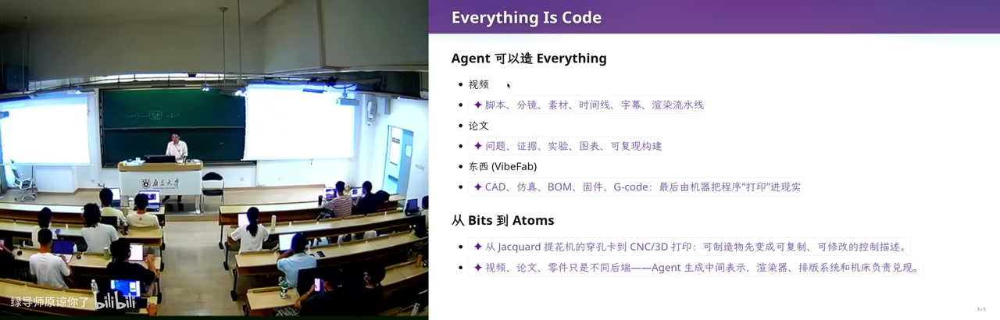

你你的想象力。

限制了你能做什么。

就这个，对吧？我我我们总结一下，我们作为一般人。

一般人可以。

啊，学习对吧？看书。

呃，可以做总结。

然后可以实现一个这样的。

信息处理的闭环。

还可以操作，对吧？用 computer use、browser use 去做任何你平时日常里面做的。

做的事情。

同时，因为 everything is cold.

我可以用AI生成你能看到的所有的东西。

视频。

论文。

东西。

我们在做。

呃，我我在和一个同学做一个叫WebFab的项目。

用一个自然语言，我在你打印机可以打印一个东西出来。

真的东西也是扣的，也是Python代码，真的是Python代码。

所以，能够实现这个从B到Atoms。

这个未来。

已经来了。

我们看到，它只会AI的能力只会变强，不会变弱。

那么，下一个问题就是：他什么时候来，以及我们应该怎么面对他？

好。

那关于面对，我们

## [1:14:42](https://www.bilibili.com/video/BV1pb8o6yE8f?t=4482)

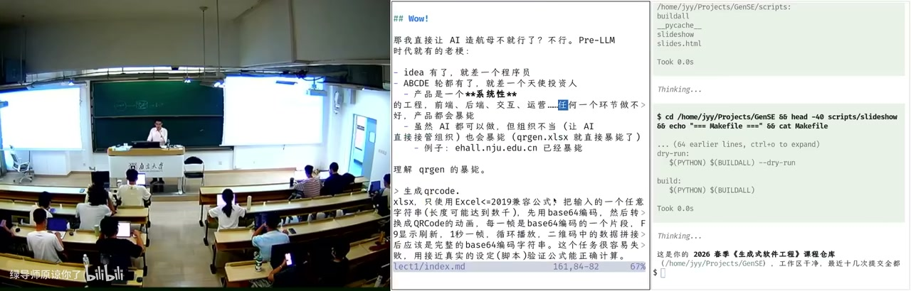

就可以进入这个生成式软件工

## [1:14:44](https://www.bilibili.com/video/BV1pb8o6yE8f?t=4484)

程最重要的内容了。

对吧？

刚才。

我们就建建建建立了一个。

思路哦，三观尽毁了。

时时代的车轮来了，我已经被压在车车底下了。

不着急。

AI也不是完全完美的。

在L M之前的时代，就有一个老梗说：“哎呀，idea都有了，我们是商学院的。这个，你不知道你们商学院同学有没有给你们说过这个？idea都有了，就差一个程序员了，我们去挣一个亿吧，对吧？然后A B C D轮也都有了，就差一个天使投资人了，没有人投资。”

他做的。

呃，没有那么简单。就是AI，首先AI很强，我我展示AI可以做什么。

但是。

产品是一个系统性的工程。

你你你，如果要做一个呃什么外卖，对吧？就是你想做一个什么外卖网站，你要做前端、后端、交互、运营。

整个流程上面任何一个环节做不好，产品都是直接暴毙的。

虽然AI都可以做每一个，对吧？AI学AI也能设计前端，也能做后端，也能交互，也能运营。他看过世界上所有的书。

他什么都知道。

但是，如果你组织的不好，

直接也是立即，立即就暴毙。

实际上，实际上。

这个。

呃，我的Q R证点一下。

我做了一个实验，让AI去做。

AI生成了完全不可维护的代码，我马上就会讲到这个软件工程内容。

然后，一号点n g u点一.点c n。

难用吗？

来，我们始终使，然后每年学校都会花巨额的钱，让这个公司维护这份代码。

就是因为它要添一个功能。打个比方，呃，我因为因为我在用这个 browser use 的时候，我还稍微 hack 了一下这个呃系统，我发现。

有些隐藏的字段。

比如说，呃，你能够看到一个学生的校区。

在之在苏州校区建成之前，这个系统里面是不需要这个字段的。

然后，为了兼容这个苏六校区，你们写过软件的人都知道。

你们。

对吧？你们在设计需求设计的时候，你没有想到学校竟然还有校区这个东西，数据库里就没有这个东西。然后突然有一天，你的产品经理说：“哎呀，我们两个校区选课要分开的时候。”

呃。

对吧？当然，你你你现在是没问题，就是因为你是产品经理，就是个AI说好，呃呃，哎呀，现在你你原来系统是可以用了。我现在多了一个校区，苏州校区，我要我要把校区分开，然后AI就开始写代码。

但是。

## [1:17:19](https://www.bilibili.com/video/BV1pb8o6yE8f?t=4639)

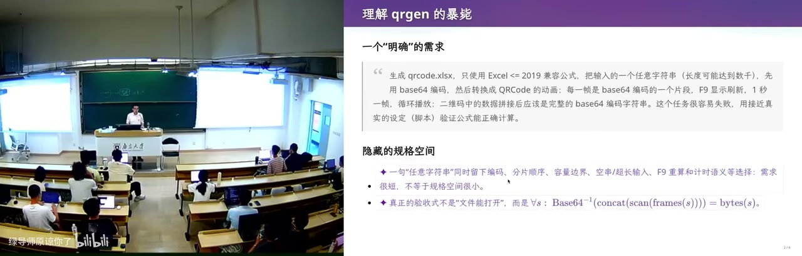

但是。

誒。

还是很容易失败的，这就是非常典型的软件工程的失败。所以我可以讲一下刚才那个Q R Gen的暴毙。

它是AI是怎么暴毙的？它是一个非常明确的需求，我要一个QR code的Excel。

然后，我只是使用这个Excel二零一九兼容的公式，把输入的任意一个字符串，呃，先用Base六十四编码，然后转成QR code动画，每一帧是什么什么什么什么什么。

然后，当然，我为了。

呃，我我我我开始让AI做的时候，还发现这个任务经常它做着就停下来问我。

然后我说：“不要，这个很容易失败。”然后你你不要问我了，必须把它做成。

呃，做成为止。

但是。

很遗憾。

AI对这个需求的理解是不到位的。

就我说

## [1:18:03](https://www.bilibili.com/video/BV1pb8o6yE8f?t=4683)

清楚了。

就。

确实，我就是要做这个东西。

## [1:18:07](https://www.bilibili.com/video/BV1pb8o6yE8f?t=4687)

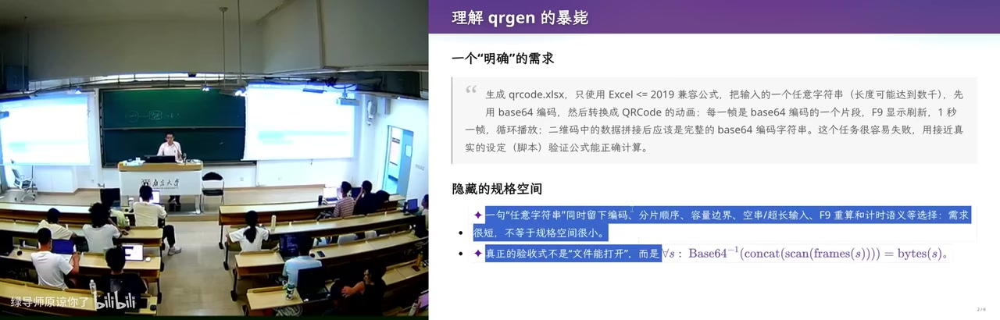

但是。

这是GPT五点六啊。

GPT五点六依然误解了我，到底要一个什么东西。

G.P.U.五点六说说的对，就。

因为他看到了我的完整的slides。

呃，但我没有告诉他我是怎么做的。

所以，他认为。

AI哪里容易犯错呢？

AI容易在小corner case上犯错。

G P五点六，第一秒钟就被带歪了。

他希望做一个对于任意的S都满足正确性的东西。

这就已经错了。

不是的。

软件工程的第一步。

不要扩大。

做最简单的东西。

不会失败。

他没有理解理解这一点。

## [1:18:49](https://www.bilibili.com/video/BV1pb8o6yE8f?t=4729)

事实上是这样的。

呃，我我后来做了一个受控的实验，就因为第一个版本是我带着AI做的，外部团队做的，所以做的还比较顺利。

然后后来，我就直接把这个 specification 就这个告诉AI，然后AI GM五点三。

第一次思考。

了二十五分钟。

然后开始疯狂的输出，写了。

超过三十二K的output token，然后直接我的cloud code就干爆了。他说：“你你直接就说我已经你已经超过了默认的output的限制了，然后被截断了，然后然后他再再跑。”

总共跑了，我我没有监管。

跑了六个小时，才跑完。

但是，对的。

所以，智谱他一直说，他他自己厉害的地方是他可以做longerier的任务，是对，他他就是后训练线人。

这个五点三。

在这个龙华S项目上，真的做的做的很好。

然后，DeepSeek V4 Pro。

也是晚上放着跑的。

他已经没有办法遵循指令了。

我第二天早上。

因为我晚上在看嘛，我第二天早上看的时候。

他给了一个Base六十四是硬编码的，就是就是

## [1:19:47](https://www.bilibili.com/video/BV1pb8o6yE8f?t=4787)

他用Python算了一个Base六十四。

这这明显就不符合这个指令嘛，对吧？把一个输入的任意字符串先用六十四编码，这肯定是。

对吧？正常人的理解应该是贝斯六次秒是用Excel公式来来编码的，他已经不听指令了。他是用Python算了一个贝斯六次，贴到那个公式框里。如果我的那个字符串改了，他的贝斯

## [1:20:08](https://www.bilibili.com/video/BV1pb8o6yE8f?t=4808)

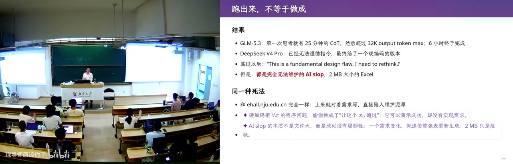

六次是不会改的。

然后我，然后我就骂他了。

我骂完以后，他那个 Charles thought 说，呃，This is a fundamental design flaw. I need to rethink. 嗯。

不管怎么样，就是他们两个最终都完成了任务，所以agent完成任务能力很强。

呃，但他们生成的都是没有办法继续维护下面下来的AI AI slop。

它和一号点N九点一九七年的死法是完全一样的，就是软件工程里面最经典的死法。

上来，我知道需求了。

我把这个需求实现了，就就就好了。

直接就陷入了维护的泥潭。

他们没有想一个好的软件的架构，使得这个软件能够，对吧？有有有一个比较。

誒。

夸张的说法说：“我们能不能做一个软件，生存一百年？”

对吧？一百年，在一百年时间里面，软件会发生很大的变化，对吧？你想，过去的没有一百年，五十年，操作系统发生了什么样的变化？图形界面发生了什么样的变化？

叫用户界面，对吧？应用程序发生了什么样的变化？有没有一个软件能生存一百年？还呃，还不知道。

但是，你看，这GPT五点六还都不知道。

## [1:21:12](https://www.bilibili.com/video/BV1pb8o6yE8f?t=4872)

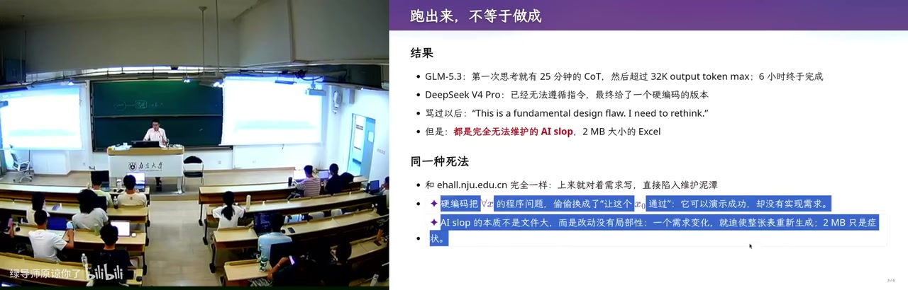

还不知道。

其实。

我们需要一个好的架构，才能完成这个任务。

## [1:21:20](https://www.bilibili.com/video/BV1pb8o6yE8f?t=4880)

呃。

我是怎么办到的呢？你们可以想一下，如果你们要，对吧？一个quick quiz，如果你们要实现这个QR阵。

你们会怎么写？

怎么Prom的AI？

对吧？我我我实际上是只用了少量的prompt，G M五点三在两百k上下文里面就完成了第一个正确的版本。我我就当时是我升级的G M点三，我就想测试一下它的能力。

我干了这样的一件事儿。

我让他设计一个各种各样的Python类，就有点像编译器一样。

比如说。

我要设计一个 Python 的函数，叫。

XOR一个符号系统。

比如说，因为因为这里面是叫位运算。

然后，这个东西既可以翻译成Py，就既可以在Python里面直接执行。

又可以翻译成Excel。

也就是说，我做了一个基础设施，像编译器一样的基础设施。

然后。

我我有什么XOR？什么Concat？

也就是说，我我我做了一个中间语言，有点像。如果你们今天做这个AI infer的话，你们会需要一个Tirelang这样的中间的语言。

我让他先设计一个中间语言。这个中间语言既对Python友好，也对Excel友好。

然后，我只需要验证的是。

我的每一个翻译都是正确到Excel到Excel正翻译是正确的。

到 Python 的结果是正确的。

然后，我可以在Python世界里面验证我的贝氏六四编码算的对不对？我的二维码的每个像素算的对不对？

然后，我再单独验证每一个东西和Excel的翻译公式翻译的正确性、兼容性。

最后一把头生成，就直接正确。

代码非常的干净，也不长。

就可能长，但是。

维护性远比你们大家可以看一下这个。

## [1:23:01](https://www.bilibili.com/video/BV1pb8o6yE8f?t=4981)

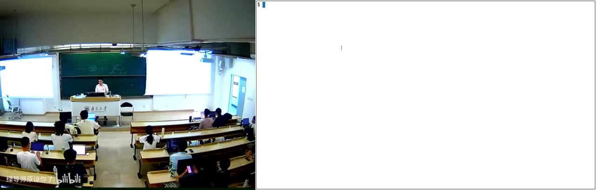

呃，看一下，看一下AIS Love啊。

呃。

G.M.五点三的这个build build excel。

## [1:23:11](https://www.bilibili.com/video/BV1pb8o6yE8f?t=4991)

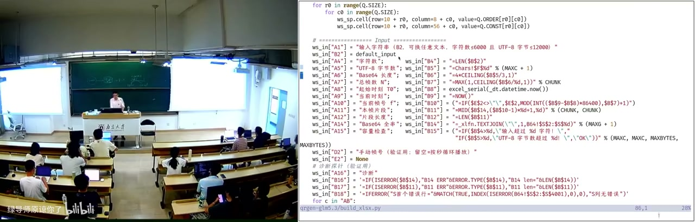

就我真的觉得A

## [1:23:15](https://www.bilibili.com/video/BV1pb8o6yE8f?t=4995)

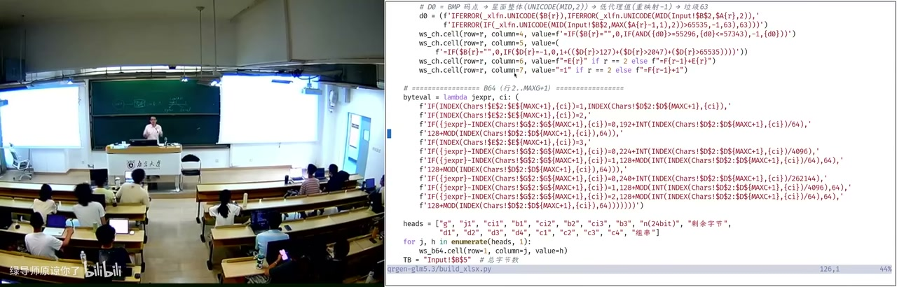

I。

还是很厉害的。

无穷多的硬件嘛。

这、这、这样啊，就这么说。

Uh.

## [1:23:23](https://www.bilibili.com/video/BV1pb8o6yE8f?t=5003)

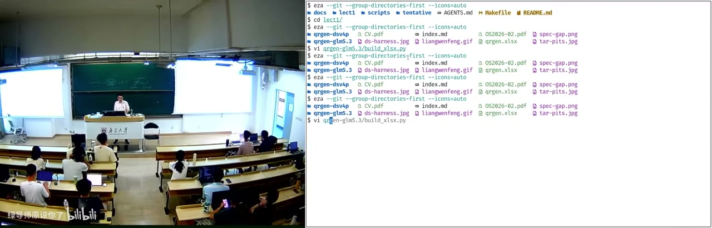

我我我们可以看一下啊！我我我我没有，我没有，我没有，没有把他的Excel。

呃，check进来，女生，然后再看一下这个Deep Deep Deepseek。

啊！

不同的方，不同的 roadmap。

但是。

## [1:23:44](https://www.bilibili.com/video/BV1pb8o6yE8f?t=5024)

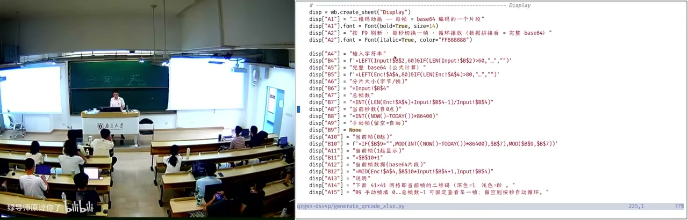

嗯。

对，反正不同的 roadmap，但是。

呃，一样的思路。

就就这么

## [1:23:51](https://www.bilibili.com/video/BV1pb8o6yE8f?t=5031)

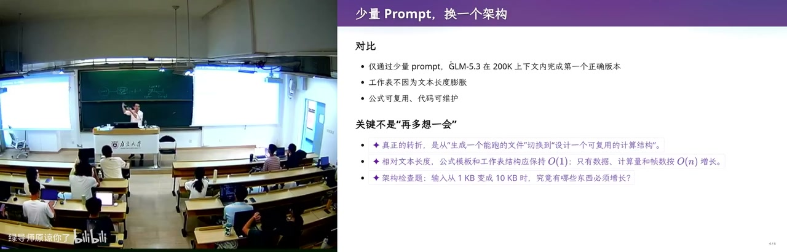

说，这两份代码。

我让他们。

把那个工作区从一个位置移动到另外一个位置。

他都得休两个小时。

就是他不停地搓，不停地搓，不停地搓。他不是，就他。

对吧？因为他所有东西都是人工买，他只要改错一点点地方，他他的 verification 就通不过，他得再再像 agent 那样。

能修，它确实可能能修完。

但是，这个是软件工程。

所以。

在今天，你还需要

## [1:24:19](https://www.bilibili.com/video/BV1pb8o6yE8f?t=5059)

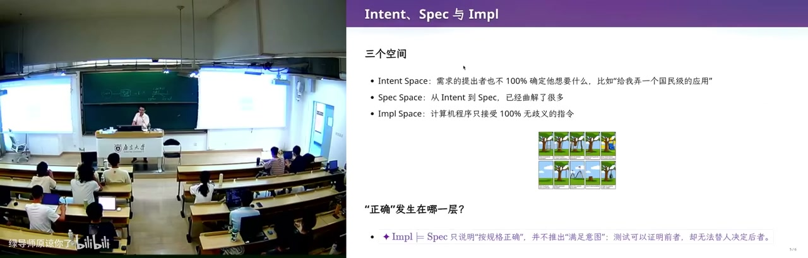

生成式软件工程。

需要需要这门课，所以我基本上就是把我我作为一个软工人，对吧？我我其实是做软件工程的。

啊！

把我的毕生所学，这个虽然我觉得AI应该也懂得，但是我不知道为什么，就是可能是因为后训练的原因。

是AI这个上手解决问题的这个欲欲望太强了，导致了呃，好像对我觉得可能做的还不是特别的好。

好，那这里面核心的问题是什么呢？

是这个世界上有有三个。

就当我们要用AI解决问题的时候，我们有三个空间。

第一个空间叫 Intention。

是你的意图。

就是你脑子里面想的是什么？比如说，老板说。

我要做一个国民级的应用。

这这是他 intention，或者说我要我要做一个小程序，给我挣一个亿，对吧？这是这是那个 intension。他这个小程序，他可能有一些想法呀。

这个，这个。

同学们点外卖不方便，我要做一个点外卖的小程序，对吧？要挣一个亿，就可以挣一个亿了。

然后，这个在 intention space 里面。

这这个是这个是是是是，这已经很大了，对吧？你有有的人有的人想想做外卖，有的人就想做这个AI读论文，对吧？AI跟同学。

然后，在这个 intention space 里面，每一个 intention。

都有很多种可能的实现。

对吧？这这是specification。

确实。

就是，呃呃，specific就是说，这个这个程序的功能是什么？选用什么样的架构？选用？

呃呃，甚至架构都都不是，就它要满足什么样的要求，对吧？它有几个界面。

然后每个界面有什么功能？就比如说，这个就是Specification。

## [1:25:58](https://www.bilibili.com/video/BV1pb8o6yE8f?t=5158)

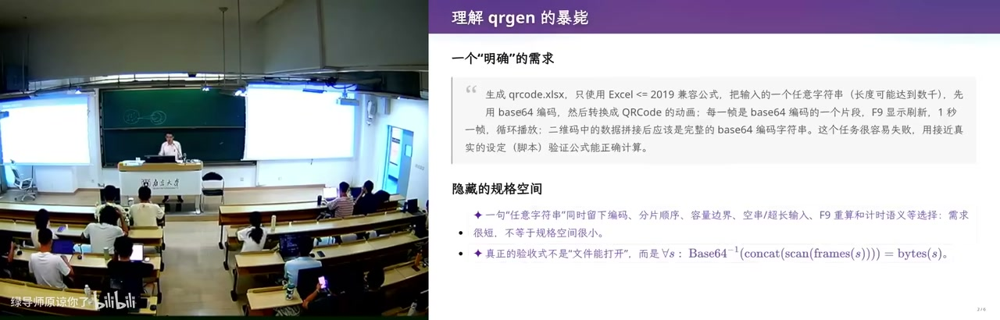

对吧？以这个例子。

那个 intention。

那个 intention 是我要造一个能够偷出二维码、偷出数据的 Excel，这是一个 intention。

对吧？相当于隐特征空间的每一个点，我要造一个Excel。

然后，这个spec就是刚才说的一句话。

然后，你看到。

## [1:26:22](https://www.bilibili.com/video/BV1pb8o6yE8f?t=5182)

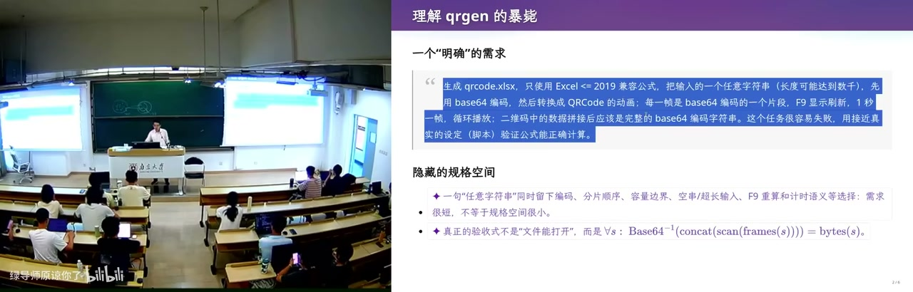

我的这个spec。

选用不同的架构，选用不同的实现方式，就像刚才那种实现方式，就会。

带来巨大的差别。

而。

满同样都是满足sp

## [1:26:35](https://www.bilibili.com/video/BV1pb8o6yE8f?t=5195)

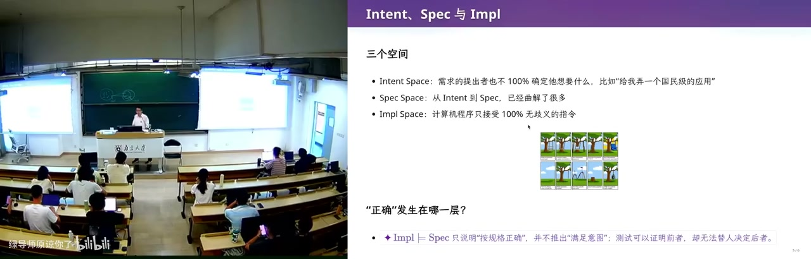

ec的。

还有不同的 implementation。

对吧？就哪怕是满足同一个。

Spec的都有大量的implementation。

所以。

软件工程。

它真正的gap就在于。

就是说，这这些东西之间是有gap的。

多少個？

因为你的 intention space 里面提需求的可能是你的老板，可能是你的甲方，他没有任何计算机的经验。

他就说：“校校长说，我们要一个教务系统。”

然后，公司说：“我可以搞定。”

引太神就在这儿！我要教务系统要做学校里面所有同学相关事情的信息化，没有了，就这一句话。

然后，在这个 specification space 内，又有好多好多的选择，不同的方式，对吧？这个界面到底怎么呈现？

我觉得这个界面设计很糟糕。

然后到这个界面完了以后。

这个数据库的schema应该怎么定？

对吧？到底应该是分哪几张表？每个表里面有哪些列？我到底要选择 key-value 型的数据库，还是关系型的数据库？每一个？

选择都会带来截然不同的。

呃，结果，所以这是一个。

这是一个海。

我看看这个这个图片怎么打开啊？

嗯。

嗯，我看一下啊，这个图片。

## [1:28:04](https://www.bilibili.com/video/BV1pb8o6yE8f?t=5284)

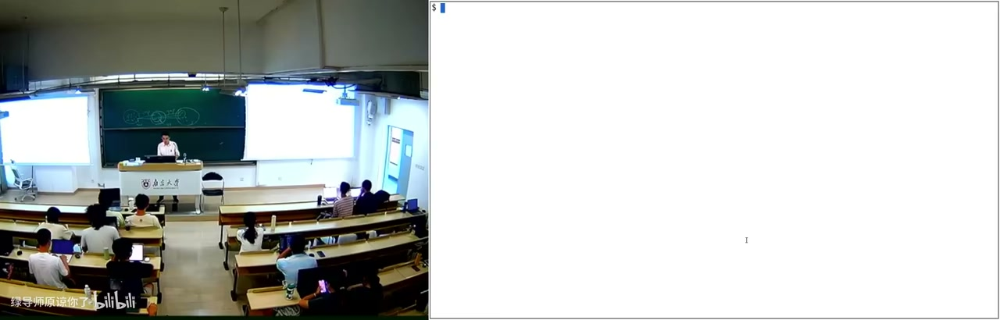

你再开一个。

## [1:28:10](https://www.bilibili.com/video/BV1pb8o6yE8f?t=5290)

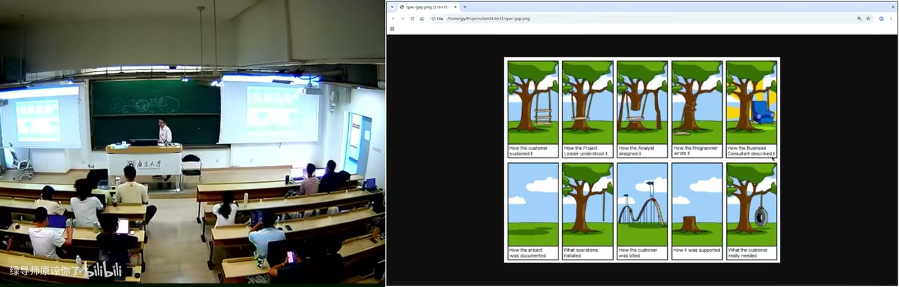

这是一个软件工程。

在。

很早的时候的一个梗图了，大概是。

就说你，他讲的就是这个这个gap。

就是在各个维度上，比如说程序员所想的。

和这个产品经理所想的，和客户所想的，它是完全不一样的，对吧？呃，这个客户是这样解释他的需求的。

然后，这个 project leader 是这样理解他的。

然后，分析的人又是这样想的。

然后，这个宣传的人又是这样宣传的。

然后，最后，实际上，这个customer要的是这个。

但是，最后。

造出来的是，对吧？

造成是这个，就这个，这个，这个，这个，这这更多，而造成这个的

## [1:28:51](https://www.bilibili.com/video/BV1pb8o6yE8f?t=5331)

根本原因。

实际上就是。

这些 space 之间的。

这个这个gap，而当我们谈软件工程，不管是软件工程还是生成式软件工程的时候，我们要做的事情就是补上。

补上这些钙。

## [1:29:04](https://www.bilibili.com/video/BV1pb8o6yE8f?t=5344)

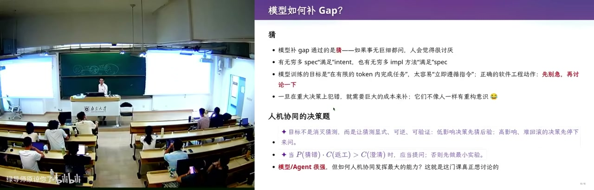

而今天，这些gap是怎么补的呢？

模型用的是猜。

对吧？模型是猜，模型就说：“好，你你既然说了这句话，那我猜应该是这个吧。”我就去实现。为什么呢？因为后训练的时候。

模型是有 reward 的，我们每个人都是 reward hacker。

对吧？模型受到奖励，它如果任务做对了、做完了、测试通过了，就会得到奖励，所以它就会形成一种倾向，它会疯狂的立即上手去把这个任务尽可能快的完成。

因为做得慢了，你也慢。

对吧？

然后，它能够越来越多地做一些简单任务。

这当然是好事儿。

但是。

呃，和人。

我们人解决问题的方式还是不一样的。你看看，我们作为计算机或者软件工程的学生。

你们。

你们是怎么学习的？

怎么弥补这gap呢？你到大一第一门课是什么？C语言程序设计。

所以，你先学的是这个东西里面有什么。

对吧？你你跳出你你学习的框架，你现在学的是这个 implementation space 里面有什么东西？把这里的东西都弄得非常熟练了哦，这个。

这个需求可以这样实现，这个需求可以这样实现，然后你再去上什么软件工程课，这样一点一点的把你对。

这件事情的任务，给补全。

但是在AI时代，这件事情当然是发生了变化，对吧？你既要阻止。

这个AI去乱猜。

AI去乱猜。

呃，你又要尽可能的发挥AI能够。

从A到B的能力，这个时候，呃。

我想，这就是我这个学期要

## [1:30:37](https://www.bilibili.com/video/BV1pb8o6yE8f?t=5437)

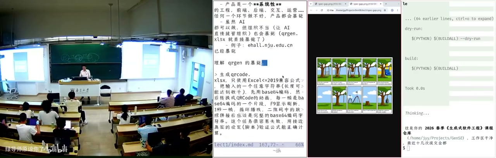

讨论的。

呃，讨论的问题。

讨论个问题。

就是，

## [1:30:42](https://www.bilibili.com/video/BV1pb8o6yE8f?t=5442)

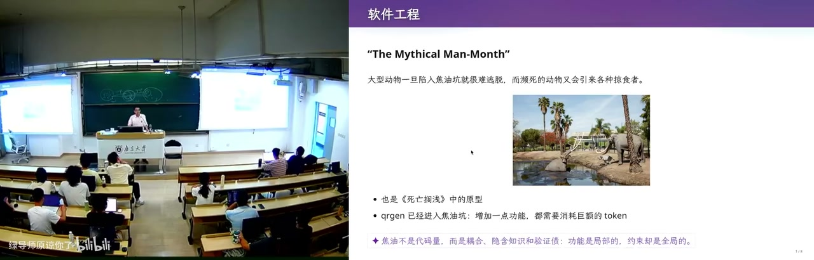

呃，我们的生成式软件工程想要想要告诉大家的。

啊，我开个头，对吧？

呃，《人月神话》The Mythical Man-Month。

大型动物一旦陷入这个焦油坑，就很难逃脱，对吧？它像泥潭一样进去以后，而且濒死的动物又会引来各种掠食者，然后他们也进了焦油坑，他们也，呃，也也出不去。

这里面有一个很经典的。

呃，论断。

是。

如果一个团队已经开始，或者一个软件产品已经开始失败了。

你加进去更多的人，只会让他变得更失败，不会变得更成功。

也就是说。

就跟刚才那个Q R阵一样。

当一个产品已经开始，AI已经开始产生slope的时候。

你投入更多的token。

你也只会让它变得更失败。AI会不断的在它那个失败的。

东西上面再往沉，再浮起来一点，浮起来一点，浮起来一点，只要你再也浮不起那个token为止。

然后，你看，教务系统不就是这样的吗？

对吧？随着供它不断的每，我觉得每一年，你打开那个教务系统。

这个，你都发现它增加了功能。

你们也也发现了，然后然后我的感受就是，学校又花了很多这个纳税人的钱，这个呃。

## [1:31:56](https://www.bilibili.com/video/BV1pb8o6yE8f?t=5516)

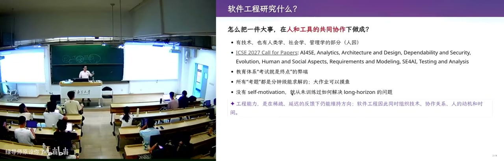

Anyway，这也许不是坏事，因为它促进了经济的。

啊，发展，是吧？啊，然后软件工程。

软件工程研究的就是。

怎么样，在这个gap实际存在的情况下？

把一件足够大的事儿，就是一个真的，对吧？

这刚才我们讲是一个很小的事儿。

教务系统是一个相对来说比较大的，就你真的去能够挣几百万、几千万的上市公司，对吧？那是上市公司。

这个你是真的可以挣到很多钱的一个产业级的产品。

然后再到你真的要做一个国民级的新的新的东西。

它有一套方法论。

然后，这个方法论就是这些人在。

投入了 billions of dollars 里面得到的教训，对吧？他管理了很多的人，每一个人都很聪明。

结果陷入了呃，交易坑。软件工程是有技术的，对吧？因为打个比方。

呃，我我们南大有很多做软件工程的老师，比如说他做什么程序分析测试的。

那他就是说，如果你生成了一个代，已经在 implementation space 里面已经有一个代码了。

我能不能自动的为它生成更多的测试用例，或者生成一个代码的审查的东西？

在这个代码不满足 specification 的时候。

或者不满潜在的不满足intention的时候，我能够给你一个warning。

对吧？他就做了一件非常非常，在这个 big picture 里面非常非常微小的事情。

然后我们有的时候，比如说你们在科技组里面开始加入科技组做研究的时候，你们就看到那个非常微小的事情，忘记了这个big picture其实是这样的。

对吧？软件工程是一个有技术。

也有人类学，也有社会学，也有管理学的部分。

然后，恰好我觉得，在生成式软件工程里面。

把它们变成了AI。

对吧？你你管一个？

一堆不会和你抬杠。

只会，You are absolutely right，对吧？我的，You are absolutely right。呃，他会听你的话的。

呃，人。

在软件工程里面，他要研究这个人不听你话怎么办？

对吧？你怎么样管管控这个团队的风险？这个人离职了怎么办？对吧？呃，跳槽了怎么办？到竞争对手去怎么办？这这都是软件工程要研究的。

然后，如果你去看，比如说一个软件工程研究领域的话，它也是一个非常广的。

对吧？AI for SE，SE for AI，架构设计可靠性。

演化这个软件能不能长期生存下去？Human social aspects需求这个特别特别重要，因为。

越早的时候。

这gap是放大的，你在。

相对，这是一个杠杆。

你在这里微微小小的变异点，你会在这里产生巨大的变化。

所以，一般来说。

这些大型的软件系统都是在这个点上面出错了，没有做好，导致了整体全部的呃崩盘。而这里面有一个呃，我觉得是我们现今教育体系的一个呃很大的问题。你们从高考过来到现在。

你们所有的考试题都是分钟级能解决的。

对吧？假设你大众演员就可以用豆包摸鱼，对吧？那那你所有上了考场的题目都是。

如果人五分钟解决不了？

那这个题，它一般来说就不会出了。

所以，你们长久以往，你们训练的就是解决，就和你们训练的那个reward和agent训练那个reward是一样的。

你能不能五分钟解决？哎，这能不能五秒钟解决？

最后是A阵，它有更多的数据，它有更明确的反馈信号，所以它做的比你好。

你没有，如果你没有一种很强的去好奇心，想要知道这个世界是怎么运行的，对吧？一个产品到底是怎么开发的，你。

你，你很有可能，你没有这种self motivation，你就没有去训练自己去解决这种轮滑来讲的问题。

最后就是，你解决龙华A诊问题，还不如A诊。

哦，这是一个，呃，当然，我觉得所以软件工程挺好。他他有些课，你你你我我知道一些软件工程同学在抱怨他们的课程，对吧？说说我上了文科，然后怎么怎么怎么，啊，你你回回过头来。

在。

就，如果你能把技术映射回这些。

文科的东西的时候，你会发现哦，其实软件工程还是就是就是这这就是一个文科嘛，就是一个管理学，这是一本管理学的书，呃，但它里面确实有很多呃真实的呃有趣的。

## [1:36:01](https://www.bilibili.com/video/BV1pb8o6yE8f?t=5761)

Catch you.

实际上啊，在大语言模型的时代。

软件工程失败的定义没有变。

就是从 intent 到 specification 到。

这个 implementation 的。

翻译错了。

对吧？要么就是隐态的spec之间不满足。

我，我，我做了一个东西，其实不是我要的。

然后，我又我做了一个实现，但是不满足我的specification，比如说正确性或者性能。

哎，呃。

但是今天模型模型，因为它有这种这个 reinforcement learning。

它对于这种真正的长程信号的reward。

还是做得不够好的。

它更多还是在怎么样机械的完成任务，所以你会发现，不管是GPT、Cloud Fable，还是这个我们现在用的，比如GM或者DeepSeek。

他在面对这个Excel问题的时候，他都不会去想让像我一样先去设计一个D.S.R。

对吧？虽然这个模型有足够的智能，可以设计一个非常好的中间语言，来把这个问题非常干净、漂亮、可维护的解决。

但是，AI的这个第一反应。

就像大家一样，就是他已经被训练成坐骑家了。

我们现在还没有，就现在，现在我觉得还没有把这个呃AI怎么样变成一个好的设计者。

就大家都说，AI现在最缺失品味嘛。

呃，这个好的工程品味给训练出来，但同时我也觉得。

既然它能做做题家。

他为什么不能有好的品味呢？我觉得可能是有的，所以我还是有危机感的。虽然就是说，我觉得这这门课我现在这么教。

可能三个月以后，或者我这个这门课还没有结束的时候，我讲所有东西都已经没用了。

这都是有可能发生的，就是我在上着上着上着上着，这门口所有东西就就不存在了。

呃。

因为我，我，我其实非常确信。

对吧？它既然能解决数学问题。

它既然能解决这种编程里面很细碎的逻辑，它为什么不能？

因为他都知道这些好的设计，他都见过。他为什么不能从他的记忆库里面找到那个好的设计，然后来解决这个问题呢？

我觉得是可以的，甚至甚至我有一些skills就能够朝这个方向。

来做。

所以。

## [1:38:09](https://www.bilibili.com/video/BV1pb8o6yE8f?t=5889)

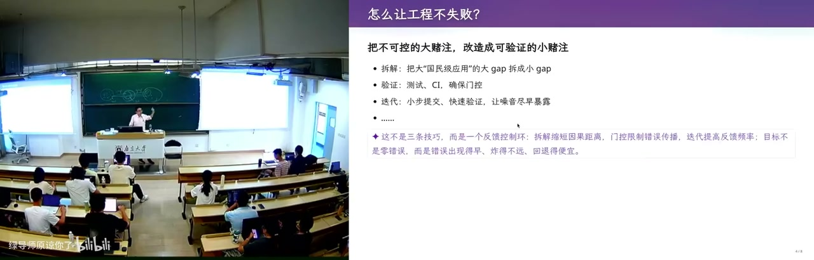

我觉得这是一个都值得我们深思的。

呃，问题，你们可以回去想一想，对吧？怎么阻止主导Q R的开

## [1:38:17](https://www.bilibili.com/video/BV1pb8o6yE8f?t=5897)

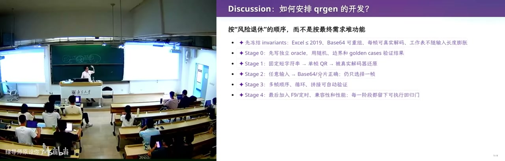

发，然后怎么设计一号点只有，但是可以告诉大家的是。

GPT五点六少。

给我的答案非常糟糕。

就是这两个设计都是。

一定会失败，但他给了一定会失败的软件工程。

呃，设计。

## [1:38:32](https://www.bilibili.com/video/BV1pb8o6yE8f?t=5912)

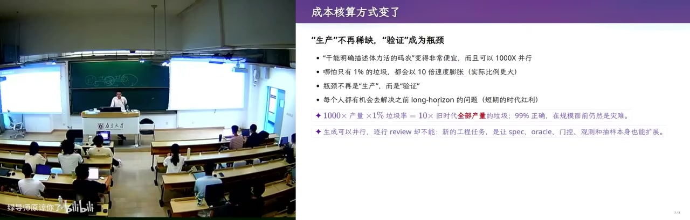

然后，我们可能会对我们的做一切的方式，可能都会。

都会发生变化。我不知道，就如果AI连品味也学不会以后。

呃，会发生，会发生什么？

所以，最

## [1:38:46](https://www.bilibili.com/video/BV1pb8o6yE8f?t=5926)

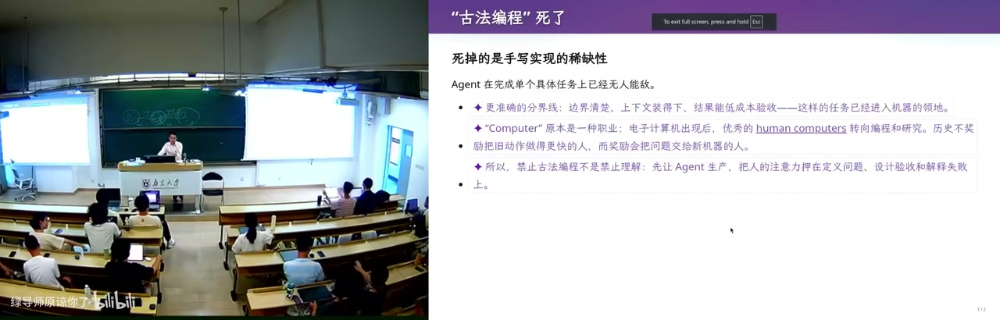

后一页。

呃，首先，古法编程已经死了，对吧？呃，A.I.在完成一个单个任务上已经无人能敌了

## [1:38:54](https://www.bilibili.com/video/BV1pb8o6yE8f?t=5934)

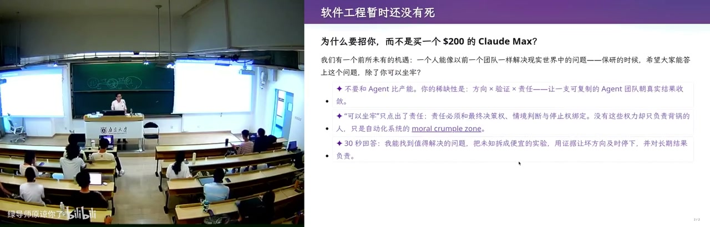

。这个软件工程暂时还没有死。

但我希望每一个同学，呃，经过这一门课的这个。

呃，可以说是探讨吧。我也不能说我我我我做的对，或者怎么样。

呃，试图回答一个问题。

在保研的时候，你的导师问你。

为什么我要招你，而不是买一个两百刀的 Cloud Max？

对吧？呃。

怎么接住这个这个问题？我觉得这个这个问题上，G P T五点六回答的还挺好的，虽然虽然它做不到，对吧？他说他能找到能值得解决的问题，把未知拆成便宜的实验。

呃，用证据让坏方向及时停下，并对长期结果负责，这这是一个好的回答。呃，但是我发现GPT五点六还做不到，就是呃很有意思。好，我今天课就到这儿，然后我会把这个今天的课程的那个内容重新切片，重新整理，但可能不会马上。呃，我应该会有一个这个生肉版，就是我我剪剪辑。

就把我今天上课的流程剪一下，会会会发布一个版本，大家可以对比那个我我可能是精修过的版本。

啊，好，今天下课。

